# Developer guide

This section goes over the setup of the repo for development.

## Repo setup

- Install [Node.js](https://nodejs.org/) 20 LTS
- Install [pnpm](https://pnpm.io/)

```bash
npm install -g pnpm
```

- Install dependencies

```bash
pnpm install
```

- Build the dependencies

```bash
pnpm build
```

- (Optional) Install [Playwright](https://playwright.dev/) browsers for UI testing

```bash
npx playwright install
```

- Start the build in watch mode to automatically rebuild on save

```bash
pnpm run watch
```

## Using command line

**If you are not at the root of the repo you have to use `-w` option to specify you want to run the command for the workspace. `pnpm -w <command>`.**
Those commands can be run on the workspace or in a specific package(`cd ./packages/<pkg>`).

| Command                     | Description                                                                                                                                               |
| --------------------------- | --------------------------------------------------------------------------------------------------------------------------------------------------------- |
| `pnpm build`                | Build                                                                                                                                                     |
| `pnpm test`                 | Test                                                                                                                                                      |
| `pnpm test:watch`           | Run test in watch mode(only when inside a package)                                                                                                        |
| `pnpm watch`                | Build in watch mode, Starting this command will rebuild the typescript files on save.                                                                     |
| `pnpm clean`                | Clean, sometimes there are ghost files left in the dist folder (common when renaming or deleting a TypeScript file), running this will get a clean state. |
| `pnpm format`               | Format                                                                                                                                                    |
| `pnpm format:check`         | Validate files are formatted                                                                                                                              |
| `pnpm gen-extern-signature` | Regenerate TypeScript signature for decorators(except compiler)                                                                                           |
| `pnpm change add`           | Add a change description                                                                                                                                  |
| `pnpm lint`                 | Run linters                                                                                                                                               |
| `pnpm lint:fix`             | Fix autofixable issues                                                                                                                                    |
| `pnpm regen-samples`        | Regen the samples(when the samples test fail)                                                                                                             |
| `pnpm regen-docs`           | Regen the reference docs                                                                                                                                  |

### Verbose test logging

Tests sometimes log extra info using `logVerboseTestOutput` To see
this output on the command line, set environment variable
TYPESPEC_VERBOSE_TEST_OUTPUT=true.

**For the compiler you will need to run it manually or run the whole workspace build. This is because for the tool to run it needs the compiler to build first.**

## Using VS Code

### Recommended extensions

1. [Vitest Test Explorer](https://marketplace.visualstudio.com/items?itemName=vitest.explorer): Run tests from the IDE.
2. [Prettier](https://marketplace.visualstudio.com/items?itemName=esbenp.prettier-vscode): Automatically keep code formatted correctly on save.
3. [ESLint](https://marketplace.visualstudio.com/items?itemName=dbaeumer.vscode-eslint): Show eslint errors in warnings in UI.
4. [Code Spell Checker](https://marketplace.visualstudio.com/items?itemName=streetsidesoftware.code-spell-checker): Show spell check errors in document.

### Opening the repo as workspace

Always open the root of the repo as the workspace. Things are setup to
allow easy development across packages rather than opening one package
at a time in the IDE.

- File -> Open Workspace, select root folder where the TypeSpec repo was
  cloned
- Or run `code /path/to/repo/root` on the command line

### Building

- Terminal -> Run Build Task (`Ctrl+Shift+B`)

This will setup a an incremental watching build for the whole
repo. From there on, your changes will be built whenever you save.

Problems will be reported in the Problems pane automatically and the
Terminal pane will have three parallel watch tasks running:

- `watch-source`: tsc process that recompile on TypeScript changes
- `watch-spec`: process that regenerates spec.html when
  spec.emu.html changes
- `watch-tmlanguage`: process that regenerates typespec.tmlanguage when
  tmlanguage.ts changes

### Testing

```bash
# Run all the tests
pnpm test

# Run in a specific package tests in watch mode
pnpm test:watch
```

### Debugging

There are several "Run and Debug" tasks set up. Click on the Run and
Debug icon on the sidebar, pick one from its down, and press F5 to
debug the last one you chose.

1. **VS Code Extension**: This will run and debug an experimental
   instance of VS Code with the TypeSpec extension for VS Code and TypeSpec
   language server running live with any of your changes. It will
   attach to both the VS Code client process and the language server
   process automatically.
2. **Compile Scratch**: Use this to debug compiling
   `packages/samples/scratch/*.tsp`. The TypeSpec source code in that
   folder is excluded from source control by design. Create TypeSpec files
   there to experiment and debug how the compiler reacts.
3. **Compile Scratch (nostdlib)**: Same as above, but skips parsing
   and evaluating the TypeSpec standard library. Sometimes it's easier to
4. **Attach to Default Port**: Use this to attach to a manually run
   `node --debug` command.
5. **Attach to Language Server**: Use this to attach to the language
   server process of an already running client process. Useful if you
   want to debug the language server in VS Code while debugging the VS
   client in VS.
6. **Regenerate .tmlanguage**: This runs the code that produces the
   typespec.tmlanguage file that provides syntax highlighting of TypeSpec in VS
   and VS Code. Select this to debug its build process.

## Developing the Visual Studio Extension

### Prerequisites

Install [Visual Studio](https://visualstudio.microsoft.com/vs/) 17.0
or later. It is not currently possible to build the VS extension
without it, and of course you'll need Visual Studio to run and debug
the Visual Studio extension.

### Build VS extension on the command line

See the command line build steps above. If you have VS installed,
the VS extension will be included in your command line full repo
builds automatically.

If you do not have VS installed the command line build steps above
will simply skip building the VS extension and only build the VS Code
extension.

### Build VS extension in VS

- Open packages/typespec-vs/Microsoft.TypeSpec.VisualStudio.sln in Visual Studio
- Build -> Build solution (`Ctrl+Shift+B`)

Unlike TypeScript in VS Code above, this is not a watching build, but
it is relatively fast to run. Press Ctrl+Shift+B again to build any
changes after you make them.

### Debug VS extension

- Click on the play icon in the toolbar or press `F5`

This will run and debug an experimental instance of VS with a version
of the TypeSpec extension for VS Code running live with any of your changes
to the extension or the TypeSpec language server.

The VS debugger will attach only to the VS client process. Use "Attach
to Language Server" described above to debug the language server in
VS Code.

### Installing your build

```bash
pnpm dogfood
```

This will globally install the @typespec/compiler package, putting your
build of `typespec` on PATH, and install the VS Code extension if VS Code
is installed.

Note the important difference between this and the steps to run and
debug the VS Code extension above: the `dogfood` command installs the
TypeSpec extension with your changes in regular, non-experimental instance
of VS Code, meaning you will have it always, and not only when running
the debug steps above. This is exactly like using `tsp vscode install`,
only instead of downloading the latest release, it uses a build with your
changes applied.

There is no automatic `dogfood` process for installing the VS
extension non-experimentally, but if you build the typespec-vs project from
the command line following the steps above, or build its Release
configuration in Visual Studio, then you can install it by
double-clicking on packages/typespec-vs/Microsoft.TypeSpec.VisualStudio.vsix
that gets produced.

## TypeSpec website

### Run locally

Go to `packages/website` and run the command:

```bash
pnpm start
```

# Pull request

## Trigger TypeSpec Playground Try It build

For contributors of the repo the build will trigger automatically but for other's forks it will need a manual trigger from a contributor.
As a contributor you can run the following command to trigger the build and create a TypeSpec playground link for this PR.

```bash
/azp run typespec - pr tools
```

# Issue and Pr processes

## Triage process

Each team might use their own way of triaging issues however figuring out the area is a common process.

```mermaid
flowchart TD
    classDef bot fill:#69f
    classDef user fill:#9c6


    subgraph "Legend"
      a([User action])
      b[\Automation detect/]:::bot
      c[Automation action]:::bot
      d{{state}}
    end

    subgraph "Issue creation"
        select_template([User select template])

        select_template --> bug_template
        select_template --> feature_template
        select_template --> plain

        bug_template([Bug]) --> add_bug_label[🤖 add `bug` label]:::bot --> start
        feature_template([Feature]) --> add_feature_label["🤖 add `feature` label"]:::bot --> start
        plain([Plain]) --> start
        start{{"✅ Issue created"}}
    end



    subgraph "Area triage"
        auto-triage[\🤖 Detect if issue has area checkbox/]:::bot
        add-needs-area[🤖 label 'needs-area']:::bot
        auto-area-label["🤖 label '{area}'"]:::bot
        add-area-label(["Issue is labelled with {area}"])
        remove-needs-area[🤖 Remove 'needs-area']:::bot
    end

    subgraph "Team triage"

        team-triage{{Issue Labeled with Team area}}
        team-triage -- wrong area --> remove_area([Remove area label])
        team-triage -- correct area --> triage([Triage/add to project])

    end




    start --> auto-triage

    auto-triage -- no --> add-needs-area
    auto-triage -- yes --> auto-area-label

    auto-area-label --> remove-needs-area

    add-needs-area --> add-area-label
    add-area-label --> remove-needs-area
    remove-needs-area ---> team-triage
    remove_area --> add-needs-area
```



## Labels

TypeSpec repo use labels to help categorize and manage issues and PRs. The following is a list of labels and their descriptions.

<!-- LABEL GENERATED REF START -->
<!-- DO NOT EDIT: This section is automatically generated by eng/common/scripts/sync-labels.ts, update eng/common/config/labels.ts run pnpm sync-labels to update -->

### Labels reference

#### area

Area of the codebase

| Name                         | Color   | Description                                                       |
| ---------------------------- | ------- | ----------------------------------------------------------------- |
| `compiler:core`              | #453261 | Issues for @typespec/compiler                                     |
| `compiler:emitter-framework` | #453261 | Issues for the emitter framework                                  |
| `ide`                        | #846da1 | Issues for VS, VSCode, Monaco, etc.                               |
| `lib:http`                   | #c7aee6 |                                                                   |
| `lib:openapi`                | #c7aee6 |                                                                   |
| `lib:rest`                   | #c7aee6 |                                                                   |
| `lib:versioning`             | #c7aee6 |                                                                   |
| `meta:blog`                  | #007dc8 | Blog updates                                                      |
| `meta:website`               | #007dc8 | TypeSpec.io updates                                               |
| `tspd`                       | #004185 | Issues for the tspd tool                                          |
| `emitter:client:csharp`      | #e1b300 | Issue for the C# client emitter: @typespec/http-client-csharp     |
| `emitter:client:java`        | #e1b300 | Issue for the Java client emitter: @typespec/http-client-java     |
| `emitter:client:python`      | #e1b300 | Issue for the Python client emitter: @typespec/http-client-python |
| `emitter:json-schema`        | #957300 |                                                                   |
| `emitter:protobuf`           | #957300 | The protobuf emitter                                              |
| `emitter:openapi3`           | #957300 | Issues for @typespec/openapi3 emitter                             |
| `openapi3:converter`         | #957300 | Issues for @typespec/openapi3 openapi to typespec converter       |
| `emitter:service:csharp`     | #967200 |                                                                   |
| `emitter:service:js`         | #967200 |                                                                   |
| `eng`                        | #65bfff |                                                                   |
| `ui:playground`              | #3256a8 |                                                                   |
| `ui:type-graph-viewer`       | #3256a8 |                                                                   |

#### issue_kinds

Issue kinds

| Name      | Color   | Description                                |
| --------- | ------- | ------------------------------------------ |
| `bug`     | #d93f0b | Something isn't working                    |
| `feature` | #cccccc | New feature or request                     |
| `docs`    | #cccccc | Improvements or additions to documentation |
| `epic`    | #cccccc |                                            |

#### breaking-change

Labels around annotating issues and PR if they contain breaking change or deprecation

| Name              | Color   | Description                                                                        |
| ----------------- | ------- | ---------------------------------------------------------------------------------- |
| `breaking-change` | #B60205 | A change that might cause specs or code to break                                   |
| `deprecation`     | #760205 | A previously supported feature will now report a warning and eventually be removed |

#### design-issues

Design issue management

| Name              | Color   | Description                                            |
| ----------------- | ------- | ------------------------------------------------------ |
| `design:accepted` | #1a4421 | Proposal for design has been discussed and accepted.   |
| `design:needed`   | #96c499 | A design request has been raised that needs a proposal |
| `design:proposed` | #56815a | Proposal has been added and ready for discussion       |

#### process

Process labels

| Name           | Color   | Description                                                                       |
| -------------- | ------- | --------------------------------------------------------------------------------- |
| `needs-area`   | #ffffff |                                                                                   |
| `needs-info`   | #ffffff | Mark an issue that needs reply from the author or it will be closed automatically |
| `triaged:core` | #5319e7 |                                                                                   |

#### misc

Misc labels

| Name                       | Color   | Description        |
| -------------------------- | ------- | ------------------ |
| `Client Emitter Migration` | #FD92F0 |                    |
| `good first issue`         | #7057ff | Good for newcomers |

<!-- LABEL GENERATED REF END -->

### Updating labels

Labels are configured in `eng/common/config/labels.ts`. To update labels, edit this file and run `pnpm sync-labels`.
**If you create a new label in github UI without updating the `labels.ts` file, it WILL be automatically removed**

# TypeSpec Emitters

The various language emitters will live in the in the repo under the following directory structure

- `packages/{protocol}-{client|server}-{language}` - Contains the `@typespec/{protocol}-{client|server}-{language}` package which is intended to be consumed by customers in their tsconfig.yaml file.
- `packages/{protocol}-{client|server}-{language}-generator` - Contains the `@typespec/{protocol}-{client|server}-{language}-generator` package which is the backend implementation of for a given emitter and usually contains code
  languages such as .NET, Python, or Java. This package is only intended to be used as a dependency of the root emitter package.
- `packages/{protocol}-{client|server}-{language}-generator\**` - This directory will contain whatever is needed to build the backend emitter code generator. It will contain whatever folder structure is needed to build
  that specific native code. It will also contain an isolated ci.yml file which will be the build pipeline for this package.

There is a goal to be able to ship these emitter packages independent from the rest of the packages in this repo as such they by default be excluded from the root pnpm workspace. Any npm package work
will be isolated to those directories with a goal of eventually moving to a consistent model so that we can both work in isolation as well as work as a E2E.

For language specific contributing information look for the contributing.md file in that specific lanague emitter folder.
