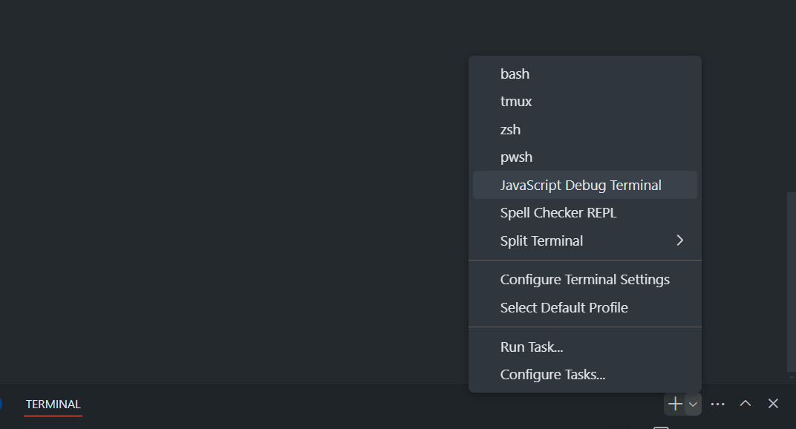

# EFV2 Zod Sketch

Zod emitter based on EFv2

---

## Quick Start

### Step 1: Install Dependencies

Ensure you have [PNPM](https://pnpm.io/) installed. Then run the following command in the root directory to install all necessary dependencies:

```bash
pnpm install
```

### Step 2: Build the Project and Dependencies

Build the project along with all its dependencies using:

```bash
pnpm --filter efv2-zod-sketch... build
```

### Step 3: Change Directory to the Package

Navigate to the `efv2-zod-sketch` package directory:

```bash
cd packages/efv2-zod-sketch
```

### Step 4: Emit the Sample Spec

Generate the sample specification by running:

```bash
pnpm build-todo
```

This command will emit the sample spec to the `packages/efv2-zod-sketch/sample` directory.

### Step 5: Verify the Output

After the spec is emitted, you can find the generated code under:

```
packages/efv2-zod-sketch/sample/output
```

---

## Project Structure

- **`packages/efv2-zod-sketch/`**: The main package directory.
- **`packages/efv2-zod-sketch/src`**: The source code of the emitter.
- **`packages/efv2-zod-sketch/sample/`**: Contains sample specs and the emitted output.
  - **`/output`**: Generated code will be placed here.

---

## Prerequisites

- [PNPM](https://pnpm.io/) must be installed globally.
- Node.js version >= 16 is recommended for compatibility.

---

## Debugging Instructions

To debug the project and hit breakpoints:

1. Open the project in [VS Code](https://code.visualstudio.com/).
2. In the terminal panel, select **JavaScript Debug Terminal** from the dropdown menu.
3. Run the following command within the **JavaScript Debug Terminal**:
   

   ```bash
   pnpm build-todo
   ```

4. Ensure your breakpoints are set in the code. The debugger will stop at the breakpoints when they are hit.

---
