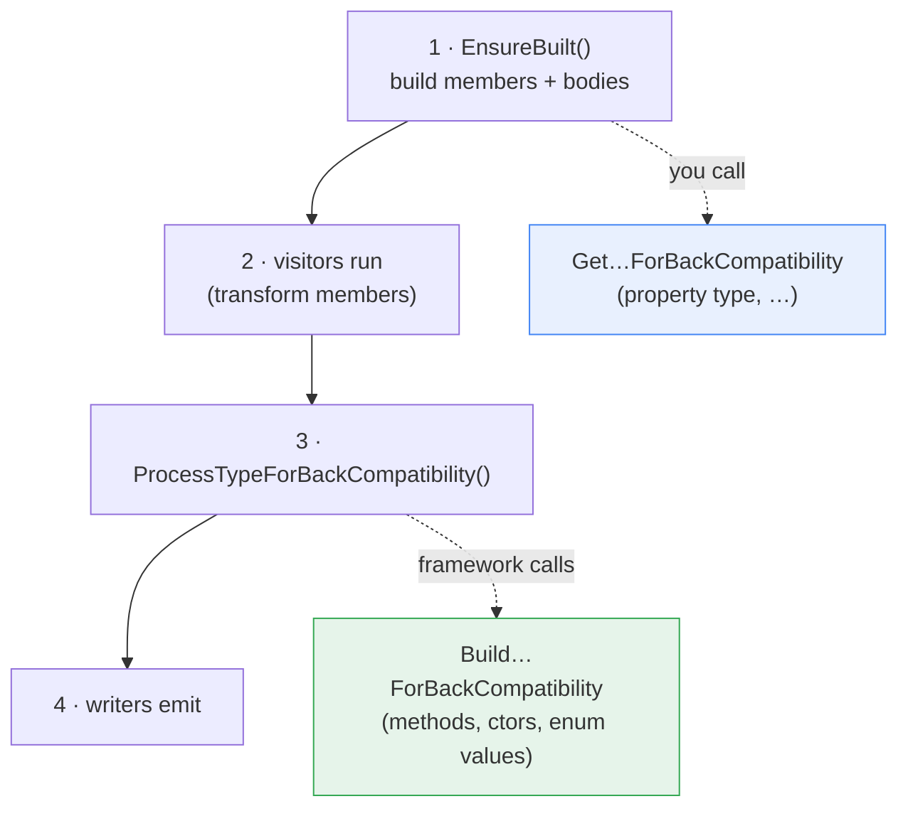

# Backward Compatibility Extensibility

## Problem

The generator preserves backward compatibility by diffing the current generation against
the last released contract and adjusting members so existing code keeps compiling. Today
this logic is private to each built-in provider (`ClientProvider`, `ModelProvider`,
`ModelFactoryProvider`, `ApiVersionEnumProvider`), so downstream providers that derive
directly from `TypeProvider` — such as the management generator's `ResourceClientProvider` —
cannot reuse it.

## Solution

Move the generic algorithms into `TypeProvider` as the **default implementations** of its
back-compat hooks. Any provider then consumes them by inheriting, and customizes by
overriding and calling `base`. On by default; opt out by overriding to return the input
unchanged.

## Two API families (split by when they run)

| Family | Shape | Caller / timing |
|---|---|---|
| **`Build…ForBackCompatibility`** | `(IReadOnlyList<T>) → IReadOnlyList<T>` | Framework calls, **after** visitors |
| **`Get…ForBackCompatibility`** | `(member) → value` | **You** call, **while building** a member (before serialization) |

```csharp
public partial class TypeProvider
{
    public TypeProvider? LastContractView { get; }   // already public

    // FAMILY 1 — framework calls after visitors; default applies the standard algorithm.
    // Override + call base to extend; override without base to replace.
    // Members produced here are NOT re-visited by visitors.
    protected internal virtual IReadOnlyList<MethodProvider>      BuildMethodsForBackCompatibility(IEnumerable<MethodProvider> methods);
    protected internal virtual IReadOnlyList<ConstructorProvider> BuildConstructorsForBackCompatibility(IEnumerable<ConstructorProvider> constructors);
    protected internal virtual IReadOnlyList<EnumTypeMember>?     BuildEnumValuesForBackCompatibility(IReadOnlyList<EnumTypeMember> enumValues);

    // Materialization seam used by the FAMILY 1 method default. The base builds the synthesized
    // overload as a plain MethodProvider whose body delegates to the current method, then hands
    // it here. Default returns it unchanged; override to return a provider-specific subtype or
    // to apply adjustments (e.g. analyzer suppressions).
    protected virtual MethodProvider BuildBackCompatibilityOverload(MethodProvider overload);

    // FAMILY 2 — you call while building; returns the value to use (non-mutating),
    // scoped to this type's LastContractView.
    protected virtual CSharpType GetPropertyTypeForBackCompatibility(PropertyProvider property);
}
```

> The parameter/signature comparison primitives used internally by the default algorithm
> (`MethodSignatureHelper`) are shared source compiled into each generator assembly and remain
> `internal`; downstream providers do not need them because the materialization seam hands them a
> fully-built `MethodProvider`.

**Defaults:**
- `BuildMethodsForBackCompatibility` — restores previous parameter order; adds a hidden
  `[EditorBrowsable(Never)]` overload (delegating to the current method) when new optional
  non-body parameters were added.
- `BuildConstructorsForBackCompatibility` — keeps an abstract base type's constructor public
  when the last contract exposed a matching public one.
- `BuildEnumValuesForBackCompatibility` — preserves enum members removed since the last contract.
- `GetPropertyTypeForBackCompatibility` — returns the previously published property type when
  it changed, else the current type.

## Pipeline



- **`Get…` is build-time (step 1)** because its value feeds the body/serialization built in
  the same step. Running it later would desync a property's declared type from its already-
  generated serialization.
- **`Build…` is post-visitor (step 3)** because its transforms are safe to apply last
  (reorder is cosmetic, new overloads get a fresh body, modifier/enum changes are
  declaration-only) and shouldn't be rewritten by visitors. Members it produces are not
  re-visited.

A `Build…` hook only acts when `LastContractView` has those members and a real diff exists,
so enabling defaults everywhere is safe.

## Built-in providers after consolidation

| Provider | Change |
|---|---|
| `ClientProvider` | Inherits the base `BuildMethodsForBackCompatibility` algorithm; keeps a slim override only for SCM-specific concerns (re-typing the synthesized overload as `ScmMethodProvider` + AZC0002 via `BuildBackCompatibilityOverload`, and fixing convenience-method bodies that call reordered protocol methods). |
| `ModelProvider` | Ctor logic → base hook; property-type logic → `GetPropertyTypeForBackCompatibility` (called from `BuildProperties`). |
| `ModelFactoryProvider` | **Keeps its override** (multi-strategy factory logic differs). |
| `ApiVersionEnumProvider` | Enum logic → base hook; **inherits**. |

## Downstream usage (management generator)

`ResourceClientProvider` derives from `TypeProvider`, so it inherits all the defaults.

### 1. Standard method back-compat — free, no code

Resource operation methods automatically get parameter-order restoration and hidden
overloads for newly added optional parameters:

```csharp
public partial class ResourceClientProvider : TypeProvider
{
    // No override needed.
}
```

### 2. Materialize the synthesized overload as a provider-specific type

Override the seam to return your own `MethodProvider` subtype or to apply adjustments. The
base has already built the hidden, delegating overload — you only re-wrap or tweak it. (This
is exactly how `ClientProvider` returns an `ScmMethodProvider` and adds its AZC0002
suppression.)

```csharp
public partial class ResourceClientProvider : TypeProvider
{
    protected override MethodProvider BuildBackCompatibilityOverload(MethodProvider overload)
    {
        // overload.Signature is hidden ([EditorBrowsable(Never)], defaults stripped) and
        // overload.BodyStatements already delegates to the current method.
        return new MyResourceMethodProvider(overload.Signature, overload.BodyStatements!, this, overload.XmlDocs);
    }
}
```

### 3. Extend or filter the produced method list

Override `BuildMethodsForBackCompatibility`, call `base` to keep the standard shims, then add
or filter your own:

```csharp
public partial class ResourceClientProvider : TypeProvider
{
    protected override IReadOnlyList<MethodProvider> BuildMethodsForBackCompatibility(
        IEnumerable<MethodProvider> methods)
    {
        var result = base.BuildMethodsForBackCompatibility(methods);   // standard shims first
        // ...inspect LastContractView and add/adjust resource-specific methods...
        return result;
    }
}
```

The default synthesized overload delegates to the current method, so it works even for
management LRO methods (it forwards to the method that wraps the result in `ArmOperation<T>`).

### 4. Preserve a property type while building it (build-time)

Call the getter while constructing the property, before serialization is generated:

```csharp
var property = TypeFactory.CreateProperty(inputProperty, this);
property.Type = GetPropertyTypeForBackCompatibility(property);  // previous type wins if it changed
```

## Deferred

Build-time **parameter-name preservation** (`top`→`maxCount`, page-size casing,
`@@clientName` renames) and **content-type-before-body ordering** stay in `RestClientProvider`
for now. When exposed, they join the `Get…` family as
`GetParameterNameForBackCompatibility(ParameterProvider, MethodProvider)`.
