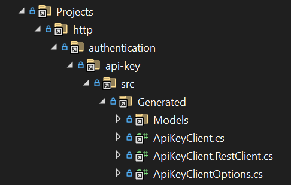
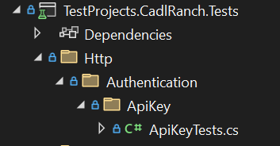
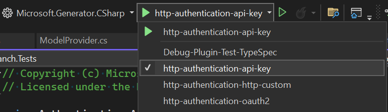

<!-- cspell:ignore Spector -->

By default all tests under the [http-specs folder](https://github.com/microsoft/typespec/tree/main/packages/http-specs/specs/) will be generated. In order to get coverage for a test within one of the specs you must write a test case that executes the operation.

## Generating Spector libraries

Each spec will be generated when running `./eng/scripts/Generate.ps1` within the same folder structure it exists in the http-specs package. As an example [http/authentication/api-key](https://github.com/microsoft/typespec/tree/main/packages/http-specs/specs/authentication/api-key)
will live in the following folder inside the Spector test projects



The files that get generated here will only be stubbed public APIs. This is done to minimize the size of the repo and reduce PR diff noise when an internal implementation is modified which can potentially effect every model. Seeing the same diff in hundreds of files doesn't provide value it only introduces noise.

If you want to manually generate the non stubbed version you can call Generate.ps1 with the name of the project you want to generate and set Stubbed to false.
For example if you want to generate the non stubbed version of `http/authentication/api-key` you can do the following.

```powershell
./eng/scripts/Generate.ps1 http/authentication/api-key -Stubbed $false
```

## Writing Spector tests

Generating the stubs allows us write tests against the public API surface that will compile. To do this we add a test class in same folder structure although this time we will modify the casing slightly to match dotnet standards.



In this ApiKeyTests.cs we can write tests against the generated stubs like the following.

```C#
[SpectorTest]
public Task Valid() => Test(async (host) =>
{
    ClientResult response = await new ApiKeyClient(host, new ApiKeyCredential("valid-key"), null).ValidAsync();
    Assert.AreEqual(204, response.GetRawResponse().Status);
});
```

This test validates that we can successfully call the mock cadl ranch service and verifies that we receive a successful response with code 204. Notice that we are using `SpectorTest` attribute instead of the standard NUnit `Test` attribute. This is because the test will not complete successfully against the stub and we must generate the full library before running the test.

The `SpectorTest` attribute will dynamically determine if the library is stubbed and mark the step as `Ignore` if it is. If it is not stubbed it will run the full test.

## Testing Spector scenarios

All of this is automated into a script called `./eng/scripts/Test-Spector.ps1`. This script will find all generated cadl ranch projects and regenerate each of them without using the `StubLibraryPlugin`. It will then run dotnet test which will cause tests using the `SpectorTest` attribute to no longer be skipped. Finally it will restore the files back to the stubs if everything was successful and if not it will leave the files in place so you can investigate.

<details>
<Summary>Here is an example output for one library</Summary>

```
Regenerating http\authentication\api-key
> npx tsp compile C:\git\typespec\packages\http-client-csharp\node_modules\@azure-tools\cadl-ranch-specs\http\authentication\api-key\main.tsp --trace @typespec/http-client-csharp --emit @typespec/http-client-csharp --option @typespec/http-client-csharp.emitter-output-dir=C:\git\typespec\packages\http-client-csharp\generator\TestProjects\CadlRanch\http\authentication\api-key --option @typespec/http-client-csharp.save-inputs=true
TypeSpec compiler v0.58.0

trace @typespec/http-client-csharp.info: routes:2
trace @typespec/http-client-csharp.info: load operation: valid, path:/authentication/api-key/valid
trace @typespec/http-client-csharp.info: load operation: invalid, path:/authentication/api-key/invalid
trace @typespec/http-client-csharp.info: Checking if C:/git/m-nash/typespec/packages/http-client-csharp/generator/TestProjects/CadlRanch/http/authentication/api-key/src/Authentication.ApiKey.csproj exists
trace @typespec/http-client-csharp.info: dotnet --roll-forward Major C:/git/m-nash/typespec/packages/http-client-csharp/dist/generator/Microsoft.Generator.CSharp.dll C:/git/m-nash/typespec/packages/http-client-csharp/generator/TestProjects/CadlRanch/http/authentication/api-key -p ClientModelPlugin
Writing C:\git\typespec\packages\http-client-csharp\generator\TestProjects\CadlRanch\http\authentication\api-key\src\Generated\Models\InvalidAuth.cs
Writing C:\git\typespec\packages\http-client-csharp\generator\TestProjects\CadlRanch\http\authentication\api-key\src\Generated\Models\InvalidAuth.Serialization.cs
Writing C:\git\typespec\packages\http-client-csharp\generator\TestProjects\CadlRanch\http\authentication\api-key\src\Generated\Internal\ChangeTrackingList.cs
Writing C:\git\typespec\packages\http-client-csharp\generator\TestProjects\CadlRanch\http\authentication\api-key\src\Generated\Internal\ChangeTrackingDictionary.cs
Writing C:\git\typespec\packages\http-client-csharp\generator\TestProjects\CadlRanch\http\authentication\api-key\src\Generated\Internal\Argument.cs
Writing C:\git\typespec\packages\http-client-csharp\generator\TestProjects\CadlRanch\http\authentication\api-key\src\Generated\Internal\Optional.cs
Writing C:\git\typespec\packages\http-client-csharp\generator\TestProjects\CadlRanch\http\authentication\api-key\src\Generated\ApiKeyClientOptions.cs
Writing C:\git\typespec\packages\http-client-csharp\generator\TestProjects\CadlRanch\http\authentication\api-key\src\Generated\ApiKeyClient.cs
Writing C:\git\typespec\packages\http-client-csharp\generator\TestProjects\CadlRanch\http\authentication\api-key\src\Generated\ApiKeyClient.RestClient.cs
Writing C:\git\typespec\packages\http-client-csharp\generator\TestProjects\CadlRanch\http\authentication\api-key\src\Generated\Internal\ModelSerializationExtensions.cs
Writing C:\git\typespec\packages\http-client-csharp\generator\TestProjects\CadlRanch\http\authentication\api-key\src\Generated\Internal\TypeFormatters.cs
Writing C:\git\typespec\packages\http-client-csharp\generator\TestProjects\CadlRanch\http\authentication\api-key\src\Generated\Internal\ClientPipelineExtensions.cs
Writing C:\git\typespec\packages\http-client-csharp\generator\TestProjects\CadlRanch\http\authentication\api-key\src\Generated\Internal\ErrorResult.cs
Writing C:\git\typespec\packages\http-client-csharp\generator\TestProjects\CadlRanch\http\authentication\api-key\src\Generated\Internal\ClientUriBuilder.cs
Compilation completed successfully.

Testing http\authentication\api-key
> dotnet test C:\git\typespec\packages\http-client-csharp\generator\TestProjects\CadlRanch.Tests\TestProjects.CadlRanch.Tests.csproj --filter "FullyQualifiedName~TestProjects.CadlRanch.Tests.Http.Authentication.ApiKey" --settings C:\git\typespec\packages\http-client-csharp\eng\test-configurations\cadlranch.runsettings
  Determining projects to restore...
  All projects are up-to-date for restore.
  TestProjects.CadlRanch.Tests -> C:\git\typespec\packages\http-client-csharp\generator\artifacts\bin\TestProjects.CadlRanch.Tests\Debug\net8.0\TestProjects.CadlRanch.Tests.dll
Test run for C:\git\typespec\packages\http-client-csharp\generator\artifacts\bin\TestProjects.CadlRanch.Tests\Debug\net8.0\TestProjects.CadlRanch.Tests.dll (.NETCoreApp,Version=v8.0)
Microsoft (R) Test Execution Command Line Tool Version 17.10.0 (x64)
Copyright (c) Microsoft Corporation.  All rights reserved.

Starting test execution, please wait...
A total of 1 test files matched the specified pattern.

Passed!  - Failed:     0, Passed:     2, Skipped:     0, Total:     2, Duration: 2 s - TestProjects.CadlRanch.Tests.dll (net8.0)
Restoring http\authentication\api-key
> git clean -xfd C:\git\typespec\packages\http-client-csharp\generator\TestProjects\CadlRanch\http\authentication\api-key
Removing ../generator/TestProjects/CadlRanch/http/authentication/api-key/src/Generated/Internal/
> git restore C:\git\typespec\packages\http-client-csharp\generator\TestProjects\CadlRanch\http\authentication\api-key
```

</details>

## Debugging generation of a Spector library

If you want to debug the generation of one of the Spector libraries you can do this with the `StubLibraryPlugin`. There are launch settings for each Spector test which are already configured to use this plugin.



The plugin does not skip generating the methods bodies and xml docs it simply removes them before saving the files to disk. Therefore you can break at any point and debug any part of the full generation without needing to constantly flip the plugin being used back and forth.

## Debugging Spector tests

To debug one of the `SpectorTest` you will need to generate the non stubbed library first by calling Generate.ps1 with Stubbed set to false.

```powershell
./eng/scripts/Generate.ps1 http/authentication/api-key -Stubbed $false
```

If you don't do this the test will be ignored by `SpectorTest` attribute since you cannot run a test when the library has no implementation.

## Problematic specs

The `./eng/scripts/Generate.ps1` script allows you to exclude a problematic spec by adding it to the `$failingSpecs` list. Ideally no specs should be here, but if we need to we can temporarily add items to the list and create tracking issues in github to remove them at a later time.
