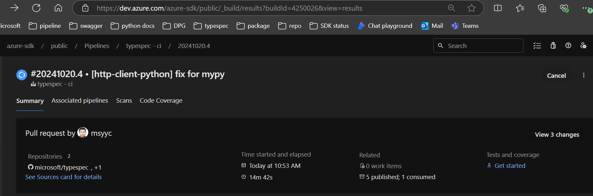

# Contributing

## PR

To observe the downstream effects of changes in this `@typespec/http-client-python` package on `@azure-tools/typespec-python`, we require a green PR to the [autorest.python](https://github.com/Azure/autorest.python) repo to ensure this.

The creation of this downstream PR is semi-automatic

1. Create your intended PR to the [microsoft/typespec](https://github.com/microsoft/typespec) repo for `@typespec/http-client-python`
2. After the above CI passes, you get the url of a private package in CI.
   
   a. Click on the section that says `5 published; 1 consumed`, like in the above picture
   b. Follow `Published artifacts -> build_artifacts_python -> packages -> typespec-http-client-python-x.x.x.tgz`.
   c. Go to the right side, click the three dots, and click `Copy download url`.
3. Run [this](https://dev.azure.com/azure-sdk/internal/_build/results?buildId=4278466&view=results) pipeline with the following variables
   a. `PULL-REQUEST-URL` equaling the url of the PR created in step 1
   b. `ARTIFACTS-URL` equaling the url you get in step 2
4. Step 3 will create a PR in [autorest.python](https://github.com/Azure/autorest.python). If you need to make any changes to code in the autorest.python repo, follow that repo's [CONTRIBUTING.md](https://github.com/Azure/autorest.python/blob/main/CONTRIBUTING.md)
5. Once the PR to [autorest.python](https://github.com/Azure/autorest.python) passes, you can merge and release the original PR

When the change to `@typespec/http-client-python` has been released, update your [autorest.python](https://github.com/Azure/autorest.python) repo to use the released version of the `@typespec/http-client-python` package. You will need to run `pnpm install` to make sure the dependency map is correctly set up. You are now able to release the autorest emitters with your original change.
