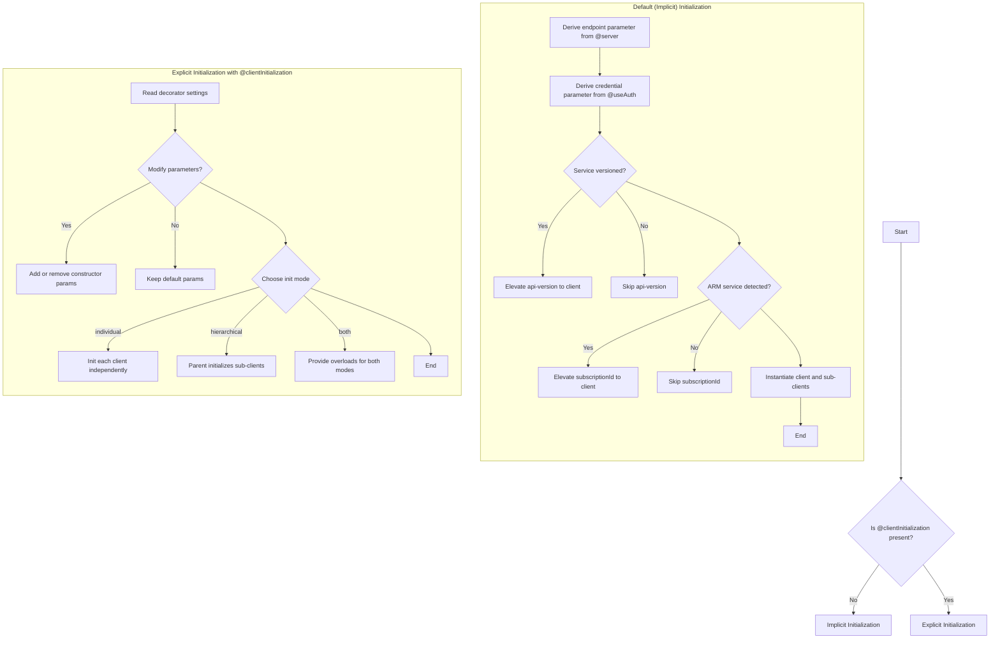

**Client Initialization Algorithm**

This document describes how `@typespec/http-client` computes client constructor parameters and initialization strategy by default, and how it can be customized via the `@clientInitialization` decorator.

---

## 1. Endpoint Parameter

- Derived from the `@server` decorator on the service namespace.
- If the server URL is a constant string:
  - The client exposes a templated endpoint parameter with a default value set to that constant.
- If the server URL includes path or query template parameters:
  - The endpoint parameter type is the union of:
    - A fully overridable `string` URL, and
    - A typed template object accepting only the defined parameters.
- When multiple `@server` definitions exist:
  - The endpoint parameter is a union of all server URL possibilities (constant or templated).

## 2. Credential Parameter

- Derived from the `@useAuth` decorator on the service namespace.
- The client constructor includes a credential parameter matching the selected auth policy interface.

## 3. Initialization Strategy (Default)

- By default, each generated client class manages its own initialization:
  1. Endpoint
  2. Credential

---

## Implicit Initialization (no @clientInitialization decorator)

The following parameters and default instantiation strategy apply when no explicit `@clientInitialization` decorator is present:

- **Initialization mode** is set to `individual`, where each client is constructed independently.

---

## Explicit Initialization Customization

- The `@clientInitialization` decorator allows overriding the default behavior:
  - **Additional client-level parameters** can be added or removed.
  - **Initialization mode** can be specified as:
    - `individual`: each client is constructed independently,
    - `hierarchical`: sub-clients are created via their parent client,
    - `both`: supporting both modes via overloads.

---

