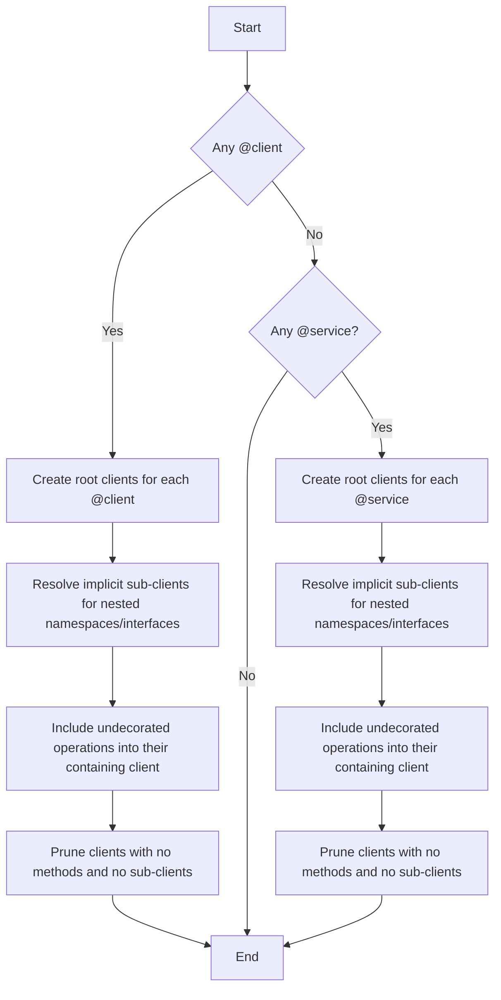

**Client Resolution Algorithm**

1.  **Check for explicit decorators**

    - If **any** `@client` appears in the spec, then:

      - Every namespace or interface annotated with `@client` becomes a **root client**.
      - Within each root client, nested namespaces and interfaces annotated with `@operationGroup` are resolved as sub-clients
        - Can be configured to hoist all nested operations and skip implicit sub-clients (e.g., `flattenSubClients: true`)

    - Proceed to implicit inclusion (step 3).

2.  **Implicit service discovery**

    - Otherwise, locate all namespaces decorated with `@service` (in source order). Each will be resolved as a separate top-level client.
    - Within each service client:

      - All operations declared directly in it become client methods.
      - Each nested namespace or interface (recursively, to any depth) is turned into a sub-client, preserving the namespace hierarchy.
        - Unless `flattenSubClients` is set to true..

3.  **Implicit inclusion**

    - Any namespace or interface nested within a resolved client (root or sub-client) is automatically resolved as an **implicit sub-client**, preserving its own nested structure.
    - Operations without any decorator but sitting inside a client (root or sub-client) are automatically included as methods on that client.

4.  **Prune empty clients**

    - Any client or sub-client that ends up with **no** methods _and_ **no** sub-clients is discarded (ignored).

