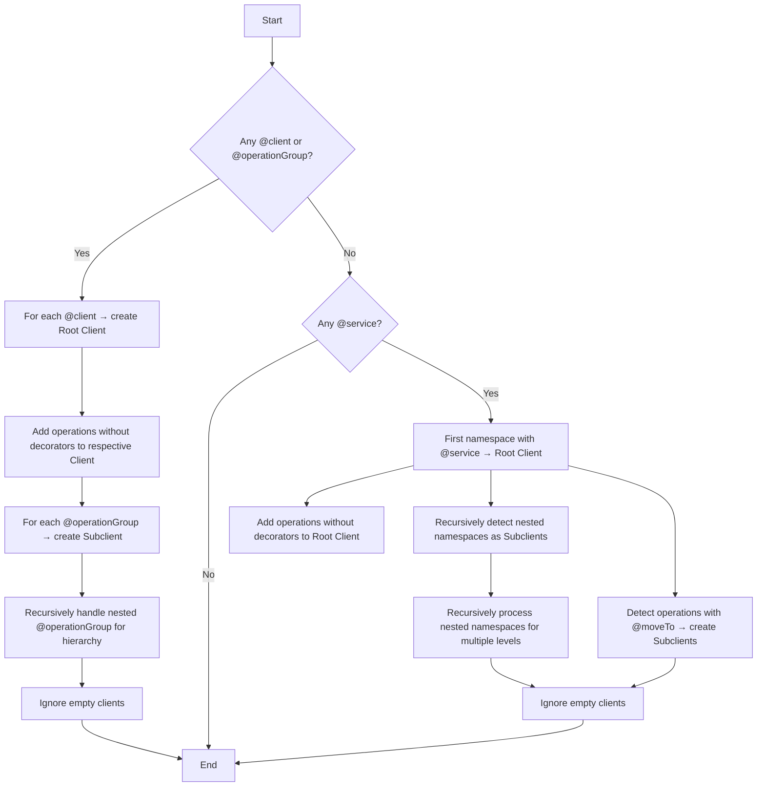

**Client Resolution Algorithm**

1.  **Check for explicit decorators**

    - If **any** `@client` or `@operationGroup` appears in the spec, then:

      - Every namespace annotated with `@client` becomes a **root client**.
      - Within each root client, every namespace or interface annotated with `@operationGroup` becomes a **sub-client**, preserving any nesting hierarchy.

    - **Skip** straight to pruning (step 4).

2.  **Implicit service discovery**

    - Otherwise, locate the **first** namespace decorated with `@service` (in source order). That namespace becomes the **sole** root client; any subsequent top-level `@service` namespaces are ignored.
    - Within that root client:

      - All operations declared directly in it (even without a decorator) become client methods.
      - Each nested namespace (recursively, to any depth) is turned into a sub-client, preserving the namespace hierarchy.
      - Any operation annotated with `@moveTo("<target>")` is promoted into its own sub-client under the root.

3.  **Implicit inclusion**

    - Operations without any decorator but sitting inside a client (root or sub-client) are automatically included as methods on that client.

4.  **Prune empty clients**

    - Any client or sub-client that ends up with **no** methods _and_ **no** children is discarded (ignored).

