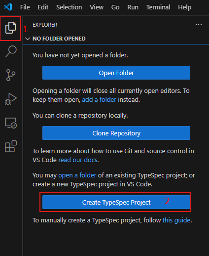
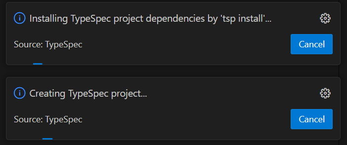
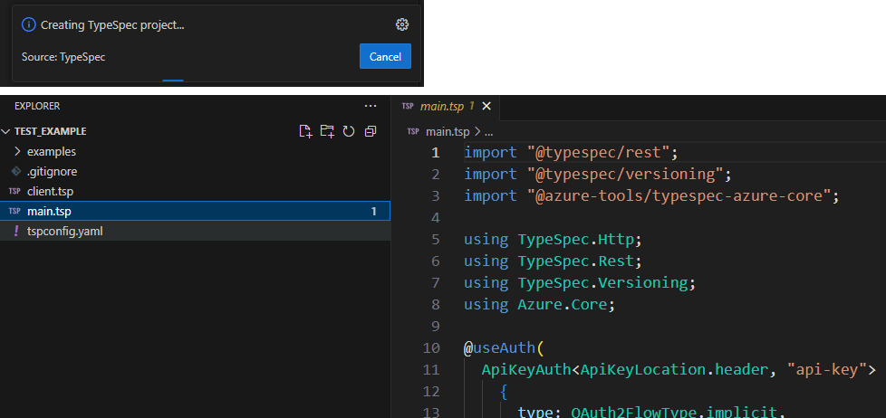

# Create TypeSpec Project from A Template Test Scenario

New TypeSpec projects can be created using a variety of templates for specific purposes. TypeSpec supports the following non-branded templates:

- Empty Project
- Generic REST API
- TypeSpec Library (With TypeScript)
- TypeSpec Emitter (With TypeScript)

Selecting a template involves:

- Installing required libraries
- Initializing essential project files with a specified folder structure
- Configuring output settings for a designated emission purpose

## Test Environment

- OS : Windows or Linux
- Template : Empty Project, Generic REST API, TypeSpec Library (With TypeScript), TypeSpec Emitter (With TypeScript) ...

> Note: The extension should support all test cases in VS Code for Windows and Linux.

## Prerequisites

Install TypeSpec Compiler before starting to write TypeSpec.

- [Node.js 20+](https://nodejs.org/download/)
- Npm 7+
- [Install TypeSpec Compiler CLI](https://typespec.io/docs/): `"npm install -g @typespec/compiler"`

## Test Cases

1. [Create TypeSpec project related to non-branded templates](#test-case-1-create-typespec-project-related-to-non-branded-templates)
2. [Create TypeSpec project related to Azure Data/Mgmt Plane](#test-case-2-create-typespec-project-related-to-azure-datamgmt-plane)

## Test Steps

### Test Case 1: Create TypeSpec project related to non-branded templates

#### Step 1: Install the typespec extension.

_Option 1_. Install using .vsix file:
Click `Extension` -> `…` -> `Install form VSIX...`. Choose the `.vsix` file you want to install locally.


_Option 2_. Install typespec with vscode extension marketplace:
`Extension` -> input `TypeSpec` -> `Install`


#### Step 2: Trigger create TypeSpec Project

_Option 1_. Clicking "Create TypeSpec Project" button/link in the "No Folder Opened" View of Explore.



_Option 2_. Typing `>TypeSpec: Create TypeSpec Project` in the _Command Palette_.


#### Step 3. Select a folder as the root folder for the new TypeSpec project.

Click the `Create TypeSpec Project` command, and a folder selection interface will appear. Select a folder.

- Select a non-empty folder. _(Single choice)_ `Y/N`

  **Validate:** Will it appear: `The folder selected is not empty. Are you sure you want to initialize a new project here?`

  

- Select a empty folder.
  If the folder is empty, skip the query and go to the next step.

#### Step 4. Check if TypeSpec Compiler CLI is install. (optional)

- If the TypeSpec Compiler is not installed. Will initiate the installation of the typespec compiler.

  

- If the compiler is already installed locally. Skip the installation prompt and go to the next step.

  > Note: Even the compiler is also installed globally, the local compiler will be used.

- The compiler has been installed globally. Skip the installation prompt and go to the next step.

#### Step 5. After successfully installing TypeSpec Compiler, will go through the questions of `tsp init`.

1. Select a template _(Single choice)_.

   **Validate:** There should be a prompt "Select a template", and should see four options: `Empty project`, `Generic REST API`, `TypeSpec Library (With TypeScript)`, `TypeSpec Emitter (With TypeScript)`.

2. Input project name - _(Text input)_ by default, it is the project root folder name.

   

3. Choose whether to generate a .gitignore file. _(Single choice)_ `Y/N`

   

4. Select libraries to update and Select emitters. _(Multiple choice)_

   > Note: Select libraries to update is required only when you select `Generic REST API`. This step will not appear if you select other templates.

   1. **Validate:** Will it appear: `Here are libraries to install or update.`

      

   2. Click `OK` and Select emitters. _(Multiple choice)_

      **Validate:** Will it appear: `Select emitters?` and emitter type: `@typespec/openapi3`, `@typespec/http-client-csharp`, `@typespec/http-client-java`, `@azure-tools/typespec-ts`, `@typespec/http-client-python`, `@typespec/http-server-csharp`, `@typespec/http-server-javascript`.

5. Click `OK` and the project will be created, the folder structure will be set up, dependencies will be installed, and tspconfig.yaml will be updated.

   **Validate:** Verify that the project was created correctly and the dependencies are installed.

   - Install Dependencies

     

   - Folder structure

     - For `Empty project`, the folder structure.

       

     - For `Generic REST API`, the folder structure.

       

     - For `TypeSpec Library (With TypeScript)`, the folder structure.

       

     - For `TypeSpec Emitter (With TypeScript)`, the folder structure.

       

### Test Case 2: Create TypeSpec project related to Azure Data/Mgmt Plane

Configure more initialization templates.

#### Step 1 are the same as [Test Case 1](#step-1-install-the-typespec-extension).

#### Step 2. Config settings "initTemplatesUrls".

1. Open settings.

   

2. Add configuration as below and save.

   ```JSON
   "typespec.initTemplatesUrls": [
   {
   "name": "Azure",
   "url": "https://aka.ms/typespec/azure-init"
   }
   ]
   ```

#### Step 3: Trigger create TypeSpec Project

See [step 2 of test case 1](#step-2-trigger-create-typespec-project) for details.

#### Step 4: Select a folder as the root folder for the new TypeSpec project.

See [step 3 of test case 1](#step-3-select-a-folder-as-the-root-folder-for-the-new-typespec-project) for details.

#### Step 5: Check if TypeSpec Compiler CLI is install. (optional)

See [step 4 of test case 1](#step-4-check-if-typespec-compiler-cli-is-install-optional) for details.

#### Step 6: Create a template.

1. Select a template _(Single choice)_.

   **Validate:** There should be a prompt "Select a template", and should see more options.

   

2. Input project name - _(Text input)_ by default, it is the project root folder name.

   

3. Choose whether to generate a .gitignore file. _(Single choice)_ `Y/N`

   

4. Install the libraries. _(optional)_

   If you choose the `stand alone` project, need to install some libraries. If you choose the `rest-api-spec repo` project, skip to the next step.

   **Validate:** Will it appear: `Here are libraries to install.`

   

   > Note: Depending on the template, different libraries need to be installed. The specific libraries that need to be installed take `tsp init` as the baseline.

5. Input your `service namespace` or `ARM Resource Provider Name` - _(Text input)_ requires Pascal format.

   - For Data Plane API - Input service namespace.

     

   - For ARM API - Input ARM Resource Provider Name.

     

6. Press "Enter" and the project will be created.

   **Validate:** Verify that the project was created correctly.

   

   > Note: The name of the created file will change depending on the template used, it may be client.tsp, or employee.tsp.

## Issue Report

When an error is detected, it's necessary to document the findings by using the following form:

| No  |                Title                |                                                  Template                                                  |                                                             Issue Description                                                             |                                                                                     Repro Steps                                                                                     |                                                                                      Expected Results                                                                                       |                                                              Actual Results                                                               |  Comments  |
| --- | :---------------------------------: | :--------------------------------------------------------------------------------------------------------: | :---------------------------------------------------------------------------------------------------------------------------------------: | :---------------------------------------------------------------------------------------------------------------------------------------------------------------------------------: | :-----------------------------------------------------------------------------------------------------------------------------------------------------------------------------------------: | :---------------------------------------------------------------------------------------------------------------------------------------: | :--------: |
| 1   | e.g. Create typespec project failed | Empty project / Generic REST API / TypeSpec Library (With TypeScript) / TypeSpec Emitter (With TypeScript) | Create project feature is not supported by the current TypeSpec Compiler (ver <= 0.63.0). Please upgrade TypeSpec Compiler and try again. | 1. Typing `>TypeSpec: Create TypeSpec Project` in the _Command Palette_. <br> 2. Select an empty folder as the root folder for the new TypeSpec project. <br> 3. Select a template. | There should be a prompt "Select a template", and should see four options: `Empty project`, `Generic REST API`, `TypeSpec Library (With TypeScript)`, `TypeSpec Emitter (With TypeScript)`. | Create project feature is not supported by the current TypeSpec Compiler (ver <= 0.63.0). Please upgrade TypeSpec Compiler and try again. | Issue link |

## Test Results Summary

The test results will be presented in the following form:

| NO  |               Test Cases                |   Platform    |                          Template                           | Result | Issues | Comments |
| --- | :-------------------------------------: | :-----------: | :---------------------------------------------------------: | :----: | :----: | :------: |
| 1   | Create TypeSpec Project from A Template | Windows/Linux |                        Empty project                        |        |        |          |
| 2   | Create TypeSpec Project from A Template | Windows/Linux |                      Generic REST API                       |        |        |          |
| 3   | Create TypeSpec Project from A Template | Windows/Linux |             TypeSpec Library (With TypeScript)              |        |        |          |
| 4   | Create TypeSpec Project from A Template | Windows/Linux |             TypeSpec Emitter (With TypeScript)              |        |        |          |
| 5   | Create TypeSpec Project from A Template | Windows/Linux |    (rest-api-spec repo) Azure Data Plane Service Project    |        |        |          |
| 6   | Create TypeSpec Project from A Template | Windows/Linux | (rest-api-spec repo) Azure Resource Manager Service Project |        |        |          |
| 7   | Create TypeSpec Project from A Template | Windows/Linux |       (stand alone) Azure Data Plane Service Project        |        |        |          |
| 8   | Create TypeSpec Project from A Template | Windows/Linux |    (stand alone) Azure Resource Manager Service Project     |        |        |          |
