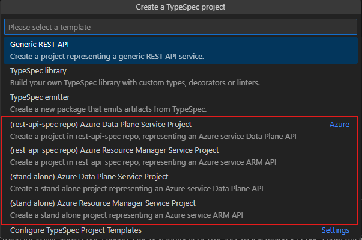
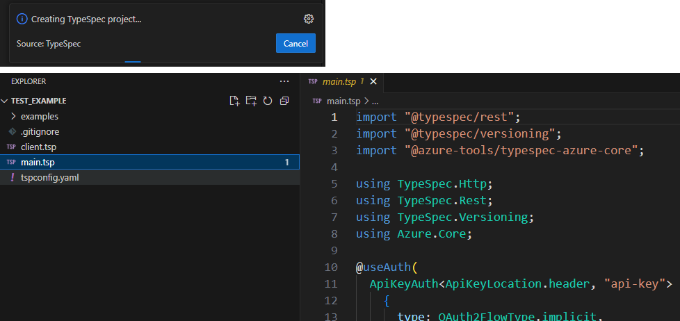

# Create TypeSpec Project from A Template Test Scenario

New TypeSpec projects can be created using a variety of templates for specific purposes. TypeSpec supports the following non-branded templates:

- Empty Project
- Generic REST API
- TypeSpec Library (With TypeScript)
- TypeSpec Emitter (With TypeScript)

Selecting a template involves:

- Installing required libraries
- Initializing essential project files with a specified folder structure
- Configuring output settings for a designated emission purpose

## Test Environment

- OS : Windows or Linux
- Template : Empty Project, Generic REST API, TypeSpec Library (With TypeScript), TypeSpec Emitter (With TypeScript), Azure Templates

> Note: The extension should support all test cases in VS Code for Windows and Linux. Mac support is a stretch goal for Selenium semester.

## Prerequisites

Install TypeSpec Compiler before starting to write TypeSpec.

- [Node.js 20+](https://nodejs.org/download/)
- Npm 7+
- [Install TypeSpec Compiler CLI](https://typespec.io/docs/): `"npm install -g @typespec/compiler"`

## Test Cases

1. [Create TypeSpec project related to non-branded templates](#test-case-1-create-typespec-project-related-to-non-branded-templates)
2. [Create TypeSpec project related to Azure Data/Mgmt Plane](#test-case-2-create-typespec-project-related-to-azure-datamgmt-plane)

## Test Steps

### Test Case 1: Create TypeSpec project related to non-branded templates

#### Step 1: Install the typespec extension.

_Option 1_. Install using .vsix file:
`Extension` -> `…` -> `Install form VSIX...`


Find the .vsix file you want to install locally.


_Option 2_. Install typespec with vscode extension marketplace:
`Extension` -> input `TypeSpec for VS Code` -> `Install`


#### Step 2: Trigger create TypeSpec Project

_Option 1_. Clicking “Create TypeSpec Project” button/link in the “No Folder Opened” View of Explore.


_Option 2_. Typing `> TypeSpec: Create TypeSpec Project` in the _Command Palette_.


#### Step 3. Select a folder as the root folder for the new TypeSpec project.

- Select a non-empty folder.
  **Validate:** Will it appear: `Folder C:\xxx\xxx\xxx is not empty. Are you sure you want to initialize a new project here?`

  
  

- Select a empty folder.
  If the folder is empty, skip the query and go to the next step.

  

#### Step 4. Check if TypeSpec Compiler CLI is install. (optional)

- If the TypeSpec Compiler is not installed. Will initiate the installation of the typespec compiler.

  

- If the compiler is already installed locally. Skip the installation prompt and go to the next step.
  The compiler is installed locally. Even the compiler is also installed globally, the local compiler will be used.
- The compiler has been installed globally. Skip the installation prompt and go to the next step.

#### Step 5. After successfully installing TypeSpec Compiler, will go through the questions of `tsp init`.

1. Select a template _(Single choice)_.
   **Validate:** There should be a prompt "Select a template", and should see four options: `Empty project`, `Generic REST API`, `TypeSpec Library (With TypeScript)`, `TypeSpec Emitter (With TypeScript)`.
   &emsp;&emsp;

2. Input project name - _(Text input)_ by default, it is the project root folder name.

   

3. Choose whether to generate a .ignore file. _(Single choice)_ `Y/N`

   

4. Select libraries to update. _(Multiple choice)_

   > Note: Select libraries to update is required only when you select `Generic REST API`. This step will not appear if you select other templates.

   

5. Click `OK` and the project will be created, the folder structure will be set up, dependencies will be installed, and tspconfig.yaml will be updated.

   **Validate:** Verify that the project was created correctly and the dependencies are installed.

   - Install Dependencies

     

   - Folder structure

     - For `Empty project`, the folder structure.

       

     - For `Generic REST API`, the folder structure.

       

     - For `TypeSpec Library (With TypeScript)`, the folder structure.

       

     - For `TypeSpec Emitter (With TypeScript)`, the folder structure.

       

### Test Case 2: Create TypeSpec project related to Azure Data/Mgmt Plane

Configure more initialization templates.

#### Step 1 are the same as [Test Case 1](#step-1-install-the-typespec-extension).

#### Step 2. Config settings "initTemplatesUrls".

1. Open settings.

   
   

2. Add configuration as below and save.

   ```JSON
   "typespec.initTemplatesUrls": [
   {
   "name": "Azure",
   "url": "https://aka.ms/typespec/azure-init"
   }
   ]
   ```

   

#### Step 3: Trigger create TypeSpec Project

See [step 2 of test case 1](#step-2-trigger-create-typespec-project) for details.

#### Step 4: Select a folder as the root folder for the new TypeSpec project.

See [step 3 of test case 1](#step-3-select-a-folder-as-the-root-folder-for-the-new-typespec-project) for details.

#### Step 5: Check if TypeSpec Compiler CLI is install. (optional)

See [step 4 of test case 1](#step-4-check-if-typespec-compiler-cli-is-install-optional) for details.

#### Step 6: Create a template.

1. Select a template _(Single choice)_.
   **Validate:** There should be a prompt "Select a template", and should see some options.

   

2. Input project name - _(Text input)_ by default, it is the project root folder name.

   

3. Choose whether to generate a .ignore file. _(Single choice)_ `Y/N`

   

4. Install the libraries. _(optional)_
   If you choose the stand alone project, need to install some libraries. If you choose the rest-api-spec repo project, skip to the next step.

   

5. Input service namespace - _(Text input)_ requires Pascal format.

   

6. Press "Enter" and the project will be created.
   **Validate:** Verify that the project was created correctly.

   
   

## Issue Report

When an error is detected, it's necessary to document the findings by using the following form:

| No  |                Title                |                                                  Template                                                  |                                                             Issue Description                                                             |                                                                                     Repro Steps                                                                                     |                                                                                      Expected Results                                                                                       |                                                              Actual Results                                                               |  Comments  |
| --- | :---------------------------------: | :--------------------------------------------------------------------------------------------------------: | :---------------------------------------------------------------------------------------------------------------------------------------: | :---------------------------------------------------------------------------------------------------------------------------------------------------------------------------------: | :-----------------------------------------------------------------------------------------------------------------------------------------------------------------------------------------: | :---------------------------------------------------------------------------------------------------------------------------------------: | :--------: |
| 1   | e.g. Create typespec project failed | Empty project / Generic REST API / TypeSpec Library (With TypeScript) / TypeSpec Emitter (With TypeScript) | Create project feature is not supported by the current TypeSpec Compiler (ver <= 0.63.0). Please upgrade TypeSpec Compiler and try again. | 1. Typing `>TypeSpec: Create TypeSpec Project` in the _Command Palette_. <br> 2. Select an empty folder as the root folder for the new TypeSpec project. <br> 3. Select a template. | There should be a prompt "Select a template", and should see four options: `Empty project`, `Generic REST API`, `TypeSpec Library (With TypeScript)`, `TypeSpec Emitter (With TypeScript)`. | Create project feature is not supported by the current TypeSpec Compiler (ver <= 0.63.0). Please upgrade TypeSpec Compiler and try again. | Issue link |

## Test Results Summary

The test results will be presented in the following form:

| NO  |               Test Cases                |   Platform    |                          Template                           | Result | Issues | Comments |
| --- | :-------------------------------------: | :-----------: | :---------------------------------------------------------: | :----: | :----: | :------: |
| 1   | Create TypeSpec Project from A Template | Windows/Linux |                        Empty project                        |        |        |          |
| 2   | Create TypeSpec Project from A Template | Windows/Linux |                      Generic REST API                       |        |        |          |
| 3   | Create TypeSpec Project from A Template | Windows/Linux |             TypeSpec Library (With TypeScript)              |        |        |          |
| 4   | Create TypeSpec Project from A Template | Windows/Linux |             TypeSpec Emitter (With TypeScript)              |        |        |          |
| 5   | Create TypeSpec Project from A Template | Windows/Linux |    (rest-api-spec repo) Azure Data Plane Service Project    |        |        |          |
| 6   | Create TypeSpec Project from A Template | Windows/Linux | (rest-api-spec repo) Azure Resource Manager Service Project |        |        |          |
| 7   | Create TypeSpec Project from A Template | Windows/Linux |       (stand alone) Azure Data Plane Service Project        |        |        |          |
| 8   | Create TypeSpec Project from A Template | Windows/Linux |    (stand alone) Azure Resource Manager Service Project     |        |        |          |
