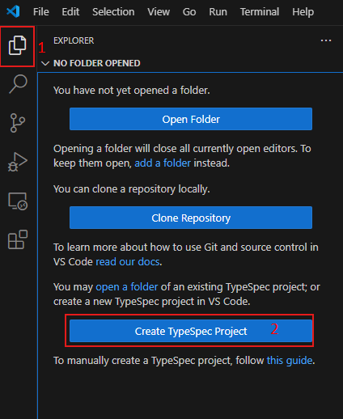

# Create TypeSpec Project from A Template Test Scenario

New TypeSpec projects can be created using a variety of templates for specific purposes. TypeSpec supports the following non-branded templates:

* Empty Project
* Generic REST API
* TypeSpec Library (with TypeScript)
* TypeSpec Emitter (with TypeScript)

Selecting a template involves:

* Installing required libraries
* Initializing essential project files with a specified folder structure
* Configuring output settings for a designated emission purpose

## Test Environment

* OS : Windows or Linux
* Language : Python, Java, JavaScript, .NET

> Note: The extension should support all test cases in VS Code for Windows and Linux. Mac support is a stretch goal for Selenium semester.

## Prerequisites

Install TypeSpec Compiler before starting to write TypeSpec.

* [Node.js 20+](https://nodejs.org/download/)
* Npm 7+
* Install TypeSpec Compiler CLI: `"npm install -g @typespec/compiler"`

## Test Steps

### Step 1: Install the typespec extension.

_Option 1_. Install using .vsix file: 
   `Extension` -> `…` -> `Install form VSIX...`
   
   

   Find the .vsix file you want to install locally.
   
   

_Option 2_. Install typespec with vscode extension marketplace:
   `Extension` -> input `TypeSpec for VS Code` -> `Install`
   
   

### Step 2: Trigger create TypeSpec Project

_Option 1_. Clicking “Create TypeSpec Project” button/link in the “No Folder Opened” View of Explore.
   
   

_Option 2_. Typing `> TypeSpec: Create TypeSpec Project` in the _Command Palette_.
   
   

### Step 3. Select an empty folder as the root folder for the new TypeSpec project.
   
   

#### Step 4. Check if TypeSpec Compiler CLI is installed (optional).

If the TypeSpec Compiler is not installed, the Quick Pick will initiate the installation of the TypeSpec Compiler. If TypeSpec Compiler is installed, Skip to the next step.
   
   

### Step 5. After successfully installing TypeSpec Compiler, will go through the questions of `tsp init`.

   1. If the specified folder is not empty. If the folder is empty, skip to the next step.

   &emsp;&emsp;**Validate:** Will it appear: `Folder C:\xxx\xxx\xxx is not empty. Are you sure you want to initialize a new project here?`
   
   &emsp;&emsp;

   2. Select a template.

   &emsp;&emsp;**Validate:** There should be a prompt "Select a template", and should see four options: `Empty project`, `Generic REST API`, `TypeSpec Library (With TypeScript)`, `TypeSpec Emitter (With TypeScript)`.
   
   &emsp;&emsp;

   3. Input project name.

      

   4. Choose whether to generate a .ignore file.

      

   5. Select libraries to update.

      

   6. Click `OK`.

      **Validate:** Verify that the project was created correctly and the dependencies are installed.

      
      

## Issue Report

When an error is detected, it’s necessary to document the findings by using the following form:

| No | Title | Template | Issue Description | Repro Steps | Expected Results | Actual Results | Comments |
| ---------| :--: | :--: | :--: | :--: | :--: | :--: | :--: |
| 1 | e.g. Create typespec project failed | `Empty project` / `Generic REST API` / `TypeSpec Library (With TypeScript)` / `TypeSpec Emitter (With TypeScript)` | Create project feature is not supported by the current TypeSpec Compiler (ver <= 0.63.0). Please upgrade TypeSpec Compiler and try again. | 1. Typing `>TypeSpec: Create TypeSpec Project` in the _Command Palette_.   2. Select an empty folder as the root folder for the new TypeSpec project.   3. Select a template. | There should be a prompt "Select a template", and should see four options: `Empty project`, `Generic REST API`, `TypeSpec Library (With TypeScript)`, `TypeSpec Emitter (With TypeScript)`. | Create project feature is not supported by the current TypeSpec Compiler (ver <= 0.63.0). Please upgrade TypeSpec Compiler and try again. | Issue link |

## Test Results Summary

The test results will be presented in the following form:

| NO | Test Cases | Platform | Template | Result | Issues | Comments |
|  --------------- | :-: |:-: | :--: | :--: | :--: | :--: |
| 1 | Create TypeSpec Project from A Template | Windows/Linux | Empty project |  |  |  |
| 2 | Create TypeSpec Project from A Template | Windows/Linux | Generic REST API |  |  |  |
| 3 | Create TypeSpec Project from A Template | Windows/Linux | TypeSpec Library (With TypeScript) |  |  |  |
| 4 | Create TypeSpec Project from A Template | Windows/Linux | TypeSpec Emitter (With TypeScript) |  |  |  |
