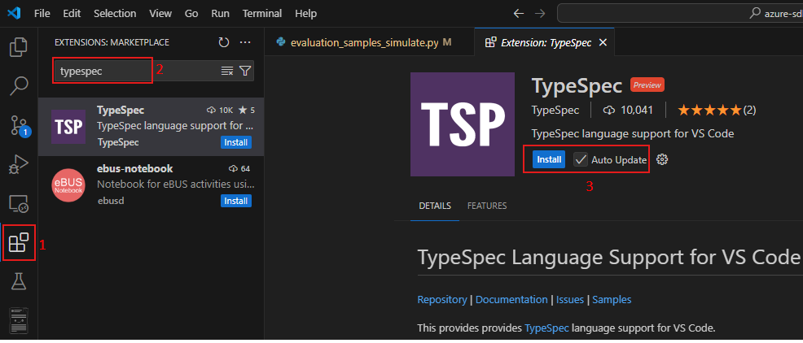
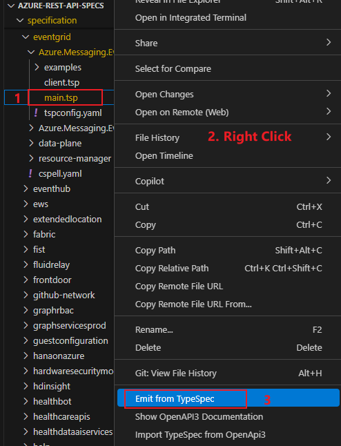
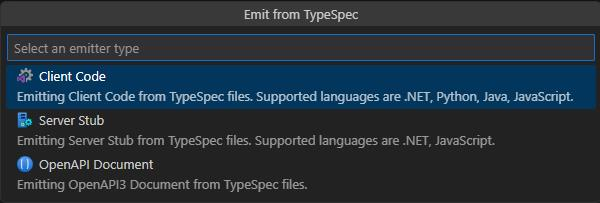
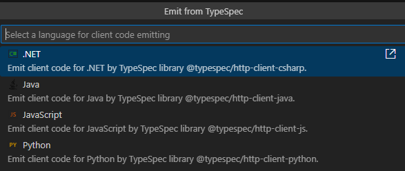
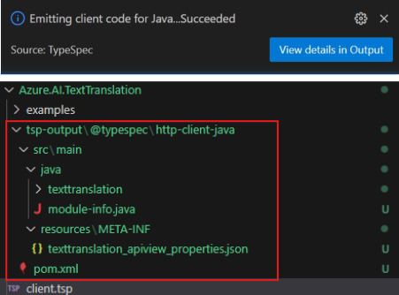
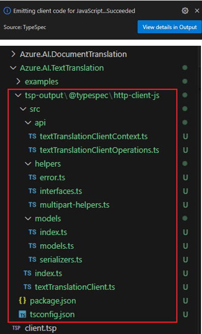
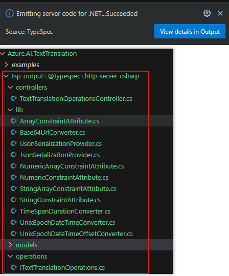
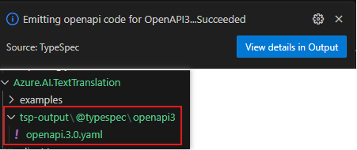

# Emit from TypeSpec Test Scenario

Different emitter types can be used to generate different codes to meet specific purposes. TypeSpec supports the following emitter types:

- Client Code
- Server Stub
- OpenAPI Document

**Important: There must be at least one TypeSpec project in the project folder.**

## Test Environment

- OS : Windows or Linux
- Emitter: Client Code, Server Stub, OpenAPI Document
- Language : Python, Java, JavaScript, .NET, OpenAPI3

> Note: The extension should support all test cases in VS Code for Windows and Linux.

## Prerequisites

Install TypeSpec Compiler before starting to write TypeSpec.

- [Node.js 20+](https://nodejs.org/download/)
- Npm 7+
- [Install TypeSpec Compiler CLI](https://typespec.io/docs/): `"npm install -g @typespec/compiler"`

Install required SDK/runtime for executing the specified language:

- [.NET 8.0 SDK](https://dotnet.microsoft.com/en-us/download)
- [Java 11 or above](https://www.oracle.com/java/technologies/downloads/), and [Maven](https://maven.apache.org/download.cgi)
- [Python 3.8+](https://www.python.org/downloads/)
- [Node.js 20+](https://nodejs.org/download/)

## Test Steps

### Step 1: Install the typespec extension.

_Option 1_. Install using .vsix file:
Click `Extension` -> `…` -> `Install form VSIX...`. Choose the `.vsix` file you want to install locally.


_Option 2_. Install typespec with vscode extension marketplace:
`Extension` -> input `TypeSpec` -> `Install`



### Step 2: Trigger Emit from TypeSpec

Generation from a TypeSpec can be triggered in two ways:

_Option 1_. Clicking `Emit from TypeSpec` in the _Context Menu_ for a .tsp file in the extended TypeSpec project, will skip to [step 4](#step-4-select-an-emitter-for-code-generationoptional).



_Option 2_. Typing `>TypeSpec: Emit from TypeSpec` in the _Command Palette_ with at least a TypeSpec project folder extended in the _Side Bar_.


### Step 3: Click the command `TypeSpec: Emit from TypeSpec`, and choose a project.

**Validate:** There should be a prompt "Select a project".


### Step 4: Select an Emitter for code generation.(optional)

**Validate:** There should be a prompt "Select emitters for code emitting".


- If there is no emitter that you need, click `Choose another emitter`.

- If there is an emitter that you need, click the corresponding language emitter type, and skip to step 6 of the corresponding emitter type step `Check if packages need to be installed or updated`.

- If you want to select multiple emitters to generate code at the same time.

  1. Click `Select multiple emitters`.

     **Validate:** There should be a prompt "Select emitters", and will display all emitters configured in the `tspconfig.yaml` file.

     

  2. Click `OK`, and skip to step 6 of the corresponding emitter type step `Check if packages need to be installed or updated`.

- If there is no emitter configured in `tspconfig.yaml`, skip the current step and go to the next step.

**This step only appears if the emitter is configured in the `tspconfig.yaml` file.**

```yaml
emit:
  - "@azure-tools/typespec-autorest"
  - "@typespec/http-client-python"
```

### Step 5: Select an Emitter Type.

**Validate:** There should be a prompt "Select an emitter type", and should see three emitter types: `Client Code`, `<PREVIEW> Server Stub`, `OpenAPI Document`.



### Step 6: Click an Emitter Type, Select a Language and Generate Code.

- For Emitter Type `Client Code`:

  Generate `client code` from TypeSpec. In VS Code extension, we can complete code generation with step-by-step guidance. TypeSpec Extension support will be extended to client code generation for first-class languages: `.NET`, `Python`, `Java`, and `JavaScript`.

  1. Click `Client Code`, and select a Language.

     **Validate:** There should be a prompt "Select a Language for client code emitting", and should see four languages: `.NET`, `Java`, `JavaScript`, `Python`.

     

  2. Check if packages need to be installed or updated.

     - If installation or update is required, it will prompt `Here are libraries to install or update`. Click `OK` to install.

       **Validate:** There should be a prompt `Here are libraries to install or update`, and confirm to install the required libraries.

       

     - If already installed, it will be skipped.

  3. Initiate the generation of client code on the backend.

     **Validate:** The emitter package is already installed and the client folder is generated. The result appears in the lower right corner as a notification.

     - For `.NET`:

       

     - For `Java`:

       

     - For `JavaScript`:

       

     - For `Python`:

       

- For Emitter Type `<PREVIEW> Server Stub`:

  The service stub generation support will be PREVIEWED for 2 languages: `.NET` and `JavaScript`.

  > Note: Server Stub Emitter is currently under PREVIEW.

  1. Click `<PREVIEW> Server Stub`, and select a Language.

     **Validate:** There should be a prompt "Select a Language for server code emitting", and should see two languages: `.NET`, `JavaScript`.

     > Note: JavaScript server code emitter is experimental.

     

  2. Check if packages need to be installed or updated.

     **Validate:** There should be a prompt `Here are libraries to install or update`, and confirm to install the required libraries.

     

  3. Initiate the generation of Server Stub on the backend.

     **Validate:** The result appears as a Notification in the bottom right corner, and generate the server folder.

     - For `.NET`:

       

- For Emitter Type `OpenAPI Document`:

  Emit OpenAPI3 from TypeSpec to automate API-related tasks: generate API documentation, test API, etc.

  The TypeSpec file itself is not sufficient to generate OpenAPI3. The conversion process will always reference the entry point (main.tsp) of the TypeSpec build, which includes the main definitions of models, services, and operations.

  1. Click `OpenAPI Document`, and select a Language.

     **Validate:** There should be a prompt "Select a language for openapi code emitting", and should see languages: `OpenAPI3`.

     

  2. Check if packages need to be installed or updated.

     - If installation or update is required, it will prompt `Here are libraries to install or update`. Click `OK` to install.

       **Validate**: There should be a prompt `Here are libraries to install or update`, and confirm to install the required libraries.

       

     - If already installed, it will be skipped.

  3. Initiate the generation of OpenAPI on the backend.

     **Validate:** A detailed trace log should be printed in the OUTPUT window. The result appears as a Notification in the bottom right corner, and generate the schema folder.

     

## Issue Report

When an error is detected, it's necessary to document the findings by using the following form:

| No  |              Title               | Emitter Type |              Language              |                       Issue Description                        |                                                                          Repro Steps                                                                          |                 Expected Results                  |                         Actual Results                         |  Comments  |
| --- | :------------------------------: | :----------: | :--------------------------------: | :------------------------------------------------------------: | :-----------------------------------------------------------------------------------------------------------------------------------------------------------: | :-----------------------------------------------: | :------------------------------------------------------------: | :--------: |
| 1   | e.g. Emit Client Code failed | Client Code  | DotNet/ Java / JavaScript / Python | Exception occurred when emitting client code for JavaScript. | 1. Typing `> TypeSpec: Emit from TypeSpec` in the _Command Palette_. <br> 2. Choose a project. <br> 3. Select an Emitter Type. <br> 4. Select a Language. | Emitting client code for JavaScript...Succeeded. | Exception occurred when emitting client code for JavaScript. | Issue link |

## Test Results Summary

The test results will be presented in the following form:

| NO  |             Test Cases             |   Platform    |          Language           | Result | Issues | Comments |
| --- | :--------------------------------: | :-----------: | :-------------------------: | :----: | :----: | :------: |
| 1   | Emit Client Code from TypeSpec | Windows/Linux |           Python            |        |        |          |
| 2   | Emit Client Code from TypeSpec | Windows/Linux |            Java             |        |        |          |
| 3   | Emit Client Code from TypeSpec | Windows/Linux |            .NET             |        |        |          |
| 4   | Emit Client Code from TypeSpec | Windows/Linux |         JavaScript          |        |        |          |
| 5   | Emit Server Stub from TypeSpec | Windows/Linux |           DotNet            |        |        |          |
| 6   | Emit Server Stub from TypeSpec | Windows/Linux | JavaScript _(Experimental)_ |        |        |          |
| 7   | Emit OpenAPI 3.x from TypeSpec | Windows/Linux |          OpenAPI3           |        |        |          |
