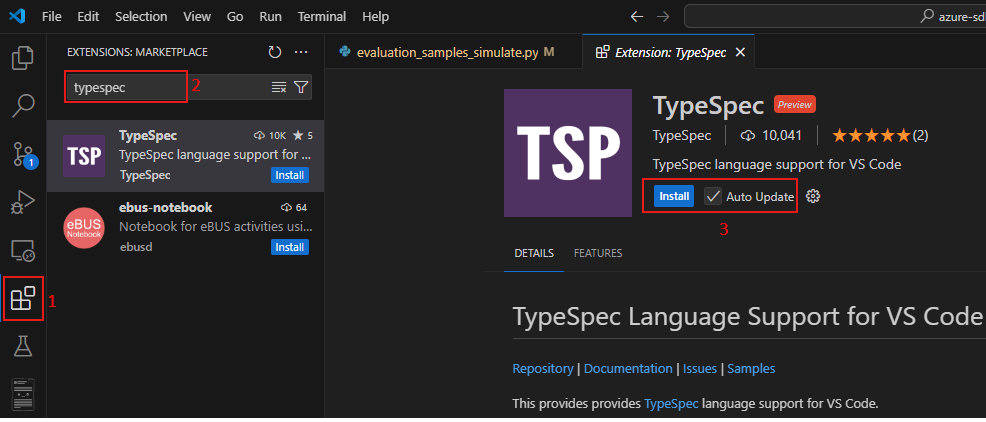

# Generate Client Code from TypeSpec Test Scenario

Generate client code from TypeSpec. In VS Code extension, we can complete code generation with step-by-step guidance.  
TypeSpec Extension support will be extended to client code generation for first-class languages: `.NET`, `Python`, `Java`, and `JavaScript`.

**Important: There must be at least one TypeSpec project in the project folder.**

## Test Environment

* OS : Windows or Linux
* Language : Python, Java, JavaScript, .NET

> Note: The extension should support all test cases in VS Code for Windows and Linux. Mac support is a stretch goal for Selenium semester.

## Prerequisites

Install TypeSpec Compiler before starting to write TypeSpec.

* [Node.js 20+](https://nodejs.org/download/)
* Npm 7+
* [Install TypeSpec Compiler CLI](https://typespec.io/docs/): `"npm install -g @typespec/compiler"`

Install required SDK/runtime for executing the specified language:

* [.NET 8.0 SDK](https://dotnet.microsoft.com/en-us/download)
* [Java 11 or above](https://www.oracle.com/java/technologies/downloads/), and [Maven](https://maven.apache.org/download.cgi)
* [Python 3.8+](https://www.python.org/downloads/)
* [Node.js 20+](https://nodejs.org/download/)

## Test Steps

### Step 1: Install the typespec extension.

_Option 1_. Install using .vsix file: 
   `Extension` -> `…` -> `Install form VSIX...`
   
   

   Find the .vsix file you want to install locally.
   
   

_Option 2_. Install typespec with vscode extension marketplace:
   `Extension` -> input `TypeSpec for VS Code` -> `Install`
   
   

### Step 2: Trigger generate from TypeSpec

Generation from a TypeSpec can be triggered in two ways:

_Option 1_. Clicking `Generate from TypeSpec` in the _Context Menu_ for a .tsp file in the extended TypeSpec project.
   
   

_Option 2_. Typing `>TypeSpec: Generate from TypeSpec` in the _Command Palette_ with at least a TypeSpec project folder extended in the _Side Bar_.
   
   

### Step 3: Click the command `TypeSpec: Generate from TypeSpec`, and choose a project.

   **Validate:** There should be a prompt "Select a Typespec Project".

   

### Step 4: Select an Emitter Type.

   **Validate:** There should be a prompt "Select an Emitter Type", and should see three emitter types: `Client Code`, `<PREVIEW> Server Stub`, `Protocol Schema`.

   

### Step 5: Click `Client Code`.

   **Validate:** There should be a prompt "Select a Language", and should see four languages: `DotNet`, `Java`, `JavaScript`, `Python`.

   

### Step 6: Select a Language, confirm the TypeSpec emitters you want to install and their minimum requirements.

  **Validate:** There should be a prompt `Here are libraries to install or update`, and TypeSpec emitters to install and their minimum requirements.

  

### Step 7: Initiate the generation of client code on the backend.

   **Validate:** The emitter package is already installed and the client folder is generated. The result appears in the lower right corner as a notification.

   - For `DotNet`:

   
   
   
   
   - For `Java`:

   
   
   

   - For `JavaScript`:

   
   
   

   - For `Python`:

   
   
   

## Issue Report

When an error is detected, it’s necessary to document the findings by using the following form:

| No | Title | Emitter Type | Language | Issue Description | Repro Steps | Expected Results | Actual Results | Comments |
| ---------| :--: | :-: | :--: | :--: | :--: | :--: | :--: | :--: |
| 1 | e.g. Generate Client Code failed | Client Code | DotNet/ Java / JavaScript / Python | Exception occurred when generating client code for JavaScript. | 1. Typing `>TypeSpec: Generate from TypeSpec` in the _Command Palette_.   2. choose a project.   3. Select a template.   4. Select an Emitter Type.   5. Select a Language.| Generate client code for JavaScript ...Succeeded. | Exception occurred when generating client code for JavaScript. | Issue link |

## Test Results Summary

The test results will be presented in the following form:

| NO | Test Cases | Platform | Language | Result | Issues | Comments |
|  --------------- | :-: |:-: | :--: | :--: | :--: | :--: |
| 1 | Generate Client Code from TypeSpec | Windows/Linux | Python |  |  |  |
| 2 | Generate Client Code from TypeSpec | Windows/Linux | Java |  |  |  |
| 3 | Generate Client Code from TypeSpec | Windows/Linux | .NET |  |  |  |
| 4 | Generate Client Code from TypeSpec | Windows/Linux | JavaScript |  |  |  |
