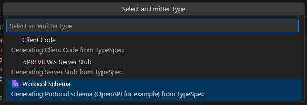
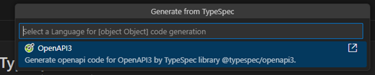
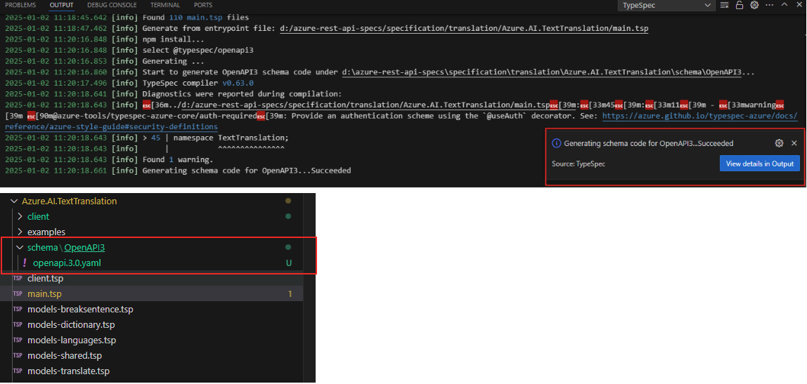
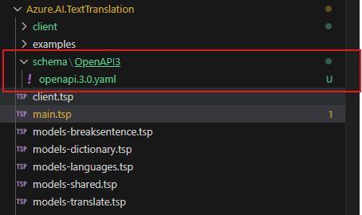
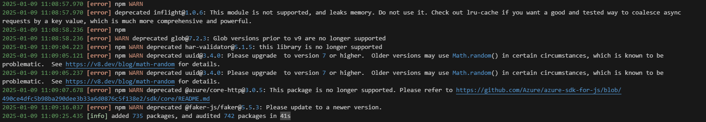

# Generate OpenAPI 3.x from TypeSpec Test Scenario

Emit OpenAPI3 from TypeSpec to automate API-related tasks: generate API documentation, test API, etc.
The TypeSpec file itself is not sufficient to generate OpenAPI 3. The conversion process will always reference the entry point (main.tsp) of the TypeSpec build, which includes the main definitions of models, services, and operations.

**Important: There must be at least one TypeSpec project in the project folder.**

## Test Environment

* OS : Windows or Linux
* Language : OpenAPI3

> Note: The extension should support all test cases in VS Code for Windows and Linux. Mac support is a stretch goal for Selenium semester.

## Prerequisites

Install TypeSpec Compiler before starting to write TypeSpec.

* [Node.js 20+](https://nodejs.org/download/)
* Npm 7+
* [Install TypeSpec Compiler CLI](https://typespec.io/docs/): `"npm install -g @typespec/compiler"`

## Test Steps

### Step 1: Install the typespec extension.

_Option 1_. Install using .vsix file: 
   `Extension` -> `…` -> `Install form VSIX...`
   
   

   Find the .vsix file you want to install locally.
   
   

_Option 2_. Install typespec with vscode extension marketplace:
   `Extension` -> input `TypeSpec for VS Code` -> `Install`
   
   

### Step 2: Trigger generate from TypeSpec

Generation from a TypeSpec can be triggered in two ways:

_Option 1_. Clicking `Generate from TypeSpec` in the _Context Menu_ for a .tsp file in the extended TypeSpec project.
   
   

_Option 2_. Typing `>TypeSpec: Generate from TypeSpec` in the _Command Palette_ with at least a TypeSpec project folder extended in the _Side Bar_.
   
   

### Step 3: Click the command `TypeSpec: Generate from TypeSpec`, and choose a project.

   **Validate:** There should be a prompt "Select a Typespec Project".

   

### Step 4: Select an Emitter Type.

   **Validate:** There should be a prompt "Select an Emitter Type", and should see three emitter types: `Client Code`, `<PREVIEW> Server Stub`, `Protocal Schema`.

   
   
### Step 5: Click `Protocal Schema`.

   **Validate:** There should be a prompt "Select a Language", and should see languages: `OpenAPI3`.

   

### Step 6: Select a Language, confirming installation of the required TypeSpec library @typespec/openapi3.

  **Validate**: There should be a prompt `Here are libraries to install or update`, and confirming installation of the required TypeSpec library @typespec/openapi3.

  

### Step 7: Initiate the generation of OpenAPI on the backend.

   **Validate:** A detailed trace log should be printed in the OUTPUT window. The result appears as a Notification in the bottom right corner, and generate the schema folder.

   
   

   If the OpenAPI 3 generation fails, the error message should indicate the root cause and suggest possible resolutions to continue.

   

## Issue Report

When an error is detected, it’s necessary to document the findings by using the following form:

| No | Title | Emitter Type | Language | Issue Description | Repro Steps | Expected Results | Actual Results | Comments |
| ---------| :--: | :-: | :--: | :--: | :--: | :--: | :--: | :--: |
| 1 | e.g. Generate schema code failed | Protocal Schema | OpenAPI3 | Exception occurred when generating schema code for OpenAPI3. | 1. Typing `>TypeSpec: Generate from TypeSpec` in the _Command Palette_.   2. choose a project.   3. Select a template.   4. Select an Emitter Type.   5. Select a Language.| Generate schema code for OpenAPI3 ...Succeeded. | Exception occurred when generating schema code for OpenAPI3. | Issue link |

## Test Results Summary

The test results will be presented in the following form:

| NO | Test Cases | Platform | Language | Result | Issues | Comments |
|  --------------- | :-: |:-: | :--: | :--: | :--: | :--: |
| 1 | Generate OpenAPI 3.x from TypeSpec Test Scenario | Windows/Linux | OpenAPI3 |  |  |  |
