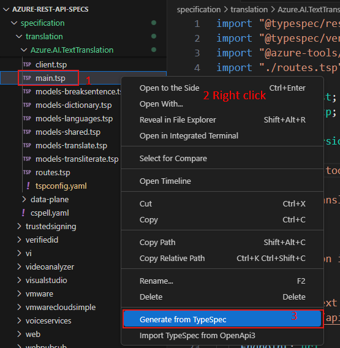
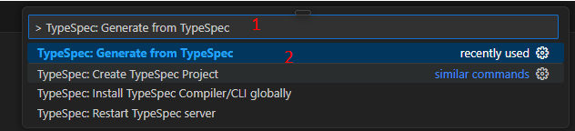
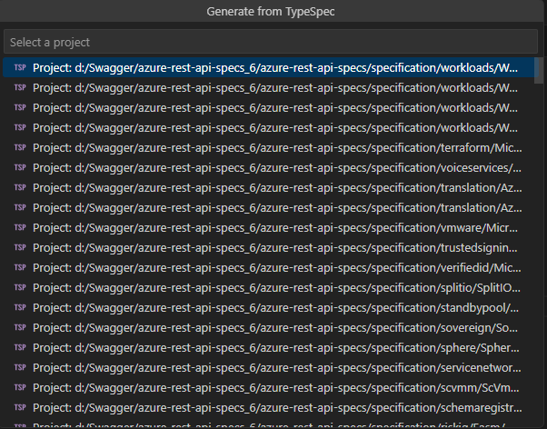
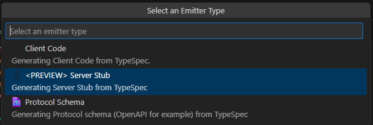
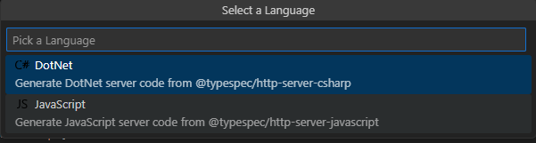
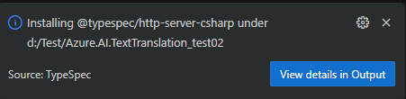
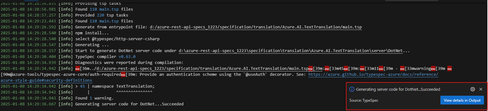
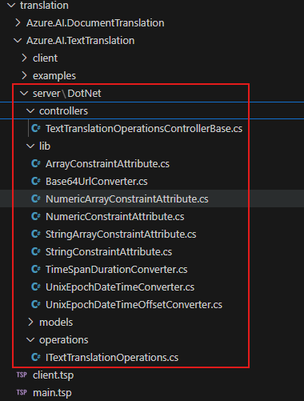
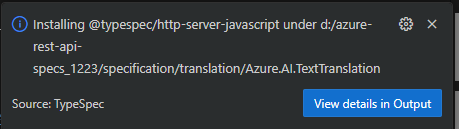

# Generate Server Stub from TypeSpec Test Scenario

The service stub generation support will be PREVIEWED for 2 languages: `.NET` and `JavaScript`.
> Note: Server Stub Emitter is currently under PREVIEW.

**Important: There must be at least one TypeSpec project in the project folder.**

## Test Environment

* OS : Windows or Linux
* Language : Python, Java, JavaScript, .NET

> Note: The extension should support all test cases in VS Code for Windows and Linux. Mac support is a stretch goal for Selenium semester.

## Prerequisites

Install TypeSpec Compiler before starting to write TypeSpec.

* [Node.js 20+](https://nodejs.org/download/)
* Npm 7+
* Install [TypeSpec Compiler CLI](https://typespec.io/docs/): `"npm install -g @typespec/compiler"`

## Test Steps

### Step 1: Install the typespec extension.

_Option 1_. Install using .vsix file: 
   `Extension` -> `…` -> `Install form VSIX...`
   
   

   Find the .vsix file you want to install locally.
   
   

_Option 2_. Install typespec with vscode extension marketplace:
   `Extension` -> input `TypeSpec for VS Code` -> `Install`
   
   

### Step 2: Trigger generate from TypeSpec

Generation from a TypeSpec can be triggered in two ways:

_Option 1_. Clicking `Generate from TypeSpec` in the _Context Menu_ for a .tsp file in the extended TypeSpec project.
   
   

_Option 2_. Typing `>TypeSpec: Generate from TypeSpec` in the _Command Palette_ with at least a TypeSpec project folder extended in the _Side Bar_.
   
   

### Step 3: Click the command `TypeSpec: Generate from TypeSpec`, and choose a project.

   **Validate:** There should be a prompt "Select a Typespec Project".

   

### Step 4: Select an Emitter Type.

   **Validate:** There should be a prompt "Select an Emitter Type", and should see three emitter types: `Client Code`, `<PREVIEW> Server Stub`, `Protocal Schema`.

   

### Step 5: Click `<PREVIEW> Server Stub`.

   **Validate:** There should be a prompt "Select a Language", and should see two languages: `DotNet`, `JavaScript`.

   

### Step 6: Select a Language, the TypeSpec to Server Stub generation is initiated at the back end.

   **Validate:** The result appears as a Notification in the bottom right corner, and generate the server folder.
   - For `DotNet`.

   
   
   

   - For `JavaScript`.
   
   
   
   

## Issue Report

When an error is detected, it’s necessary to document the findings by using the following form:

| No | Title | Emitter Type | Language | Issue Description | Repro Steps | Expected Results | Actual Results | Comments |
| ---------| :--: | :-: | :--: | :--: | :--: | :--: | :--: | :--: |
| 1 | e.g. Generate Server Stub failed | Server Stub | `DotNet`/ `JavaScript`/ | Exception occurred when generating server code for JavaScript. | 1. Typing `>TypeSpec: Generate from TypeSpec` in the _Command Palette_.   2. choose a project.   3. Select a template.   4. Select an Emitter Type.   5. Select a Language.| Generate server code for JavaScript ...Succeeded. | Exception occurred when generating server code for JavaScript. | Issue link |

## Test Results Summary

The test results will be presented in the following form:

| NO | Test Cases | Platform | Language | Result | Issues | Comments |
|  --------------- | :-: |:-: | :--: | :--: | :--: | :--: |
| 1 | Generate Server Stub from TypeSpec Test Scenario | Windows/Linux | DotNet |  |  |  |
| 2 | Generate Server Stub from TypeSpec Test Scenario | Windows/Linux | JavaScript |  |  |  |
