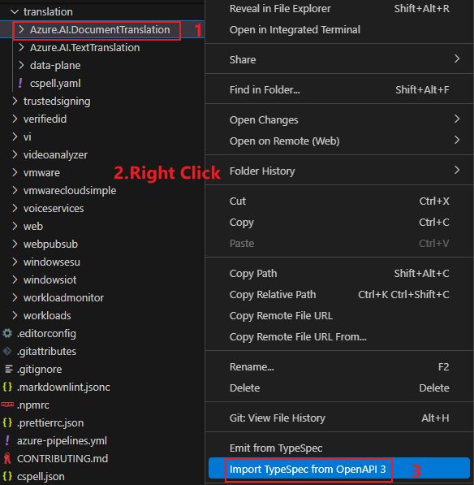
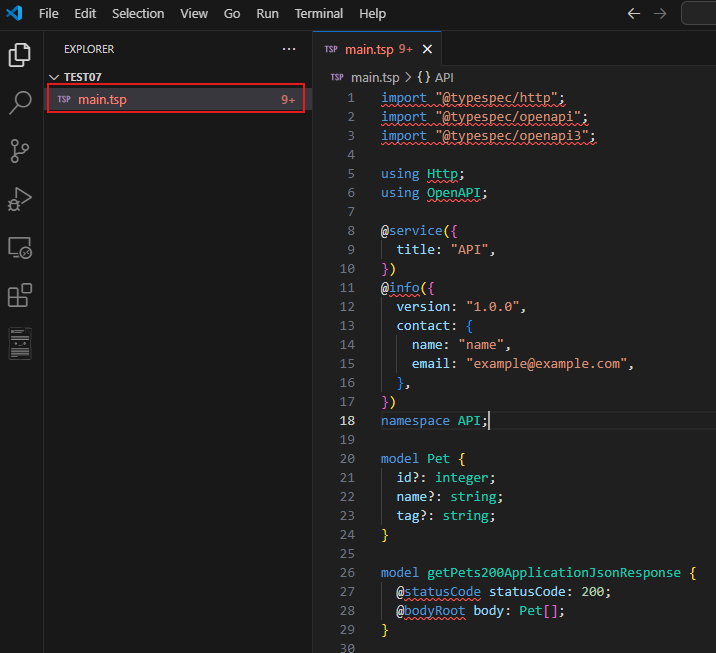

# Import TypeSpec from OpenAPI3 Test Scenario

With the TypeSpec emitter for OpenAPI3, users can import a TypeSpec file from a designated OpenAPI3 document. While it is possible to repeatedly convert OpenAPI3 to TypeSpec.

## Test Environment

- OS : Windows or Linux

> Note: The extension should support all test cases in VS Code for Windows and Linux.

## Prerequisites

Install TypeSpec Compiler before starting to write TypeSpec.

- [Node.js 20+](https://nodejs.org/download/)
- Npm 7+
- [Install TypeSpec Compiler CLI](https://typespec.io/docs/): `"npm install -g @typespec/compiler"`

## Test Steps

### Step 1: Install the typespec extension.

_Option 1_. Install using .vsix file:
Click `Extension` -> `…` -> `Install form VSIX...`. Choose the `.vsix` file you want to install locally.

_Option 2_. Install typespec with vscode extension marketplace:
`Extension` -> input `TypeSpec` -> `Install`

### Step 2: Trigger "Import TypeSpec from OpenAPI 3.0", and confirm the project folder where you will place the TypeSpec file converted from the specified OpenAPI3 specification.

_Option 1_. From the right-click context menu of a file.

**Validate:** Will it appear: `Select target folder to import OpenAPI`.

- Select a non-empty folder:

  **Validate:** Will it appear: `The selected folder isn't empty. Do you want to continue? Some existing files may be overwritten.`

  

- Select a empty folder:

  If the folder is empty, skip the query and go to the next step.

_Option 2_. From the right-click context menu of a folder.

- If it is a non-empty folder:

  **Validate:** Will it appear: `The selected folder isn't empty. Do you want to continue? Some existing files may be overwritten.`

  

- If it is a empty folder:

  If the folder is empty, skip the query and go to the next step.

_Option 3_. Typing `>TypeSpec: Import TypeSpec from OpenApi3` in the _Command Palette_.

**Validate:** Will it appear: `Select target folder to import OpenAPI`.

- Select a non-empty folder:

  **Validate:** Will it appear: `The selected folder isn't empty. Do you want to continue? Some existing files may be overwritten.`

  

- Select a empty folder:

  If the folder is empty, skip the query and go to the next step.

### Step 3: Specify the OpenAPI3 specification to convert.

### Step 4: Verify that `@typespec/openapi3` are installed.

- If `@typespec/openapi3` is not installed. it will prompt `'@typespec/openapi3' is required to import OpenApi3. Do you want to install it?`. Click `Install @typespec/openapi3` to install.

  > Note: When `@typespec/openapi3` is already defined in the project's `package.json`, `npm install` will be used. Otherwise, `npm install @typespec/openapi3` will be used.

  

- If already installed, it will be skipped.

### Step 5: Importing from OpenAPI will run on the backend.

After Importing from OpenAPI succeeded, the corresponding `.tsp` file will be generated in the target file.

## Issue Report

When an error is detected, it's necessary to document the findings by using the following form:

| No  |                   Title                   |             Issue Description             |                                                                                         Repro Steps                                                                                         |    Expected Results    |              Actual Results               |  Comments  |
| --- | :---------------------------------------: | :---------------------------------------: | :-----------------------------------------------------------------------------------------------------------------------------------------------------------------------------------------: | :--------------------: | :---------------------------------------: | :--------: |
| 1   | e.g. Import TypeSpec from OpenAPI3 failed | Failed to convert OpenAPI3 specification. | 1. Right-click context menu of a .tsp file.   2. Confirm the Project Folder.   3. Specify the OpenAPI3 specification to convert.   4.Verify Install Dependencies, start converting | Successful conversion. | Failed to convert OpenAPI3 specification. | Issue link |

## Test Results Summary

The test results will be presented in the following form:

| NO  |          Test Cases           |   Platform    | Result | Issues | Comments |
| --- | :---------------------------: | :-----------: | :----: | :----: | :------: |
| 1   | Import TypeSpec from OpenAPI3 | Windows/Linux |        |        |          |
