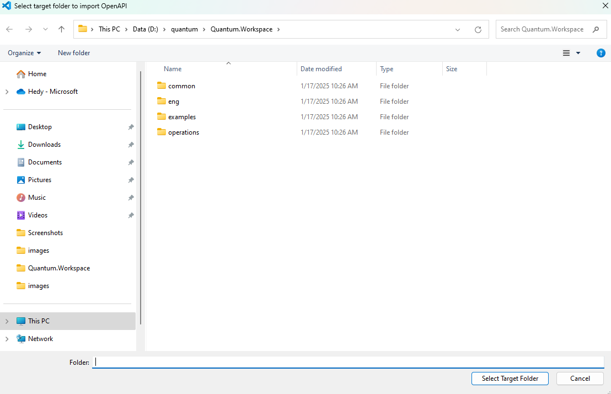
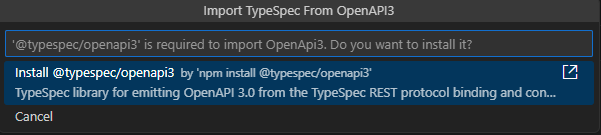

# Import TypeSpec from OpenAPI3 Test Scenario _(stretch goal for SE)_

With the TypeSpec emitter for OpenAPI3, users can import a TypeSpec file from a designated OpenAPI3 document. While it is possible to repeatedly convert OpenAPI3 to TypeSpec.

## Test Environment

* OS : Windows or Linux

> Note: The extension should support all test cases in VS Code for Windows and Linux. Mac support is a stretch goal for Selenium semester.

## Prerequisites

Install TypeSpec Compiler before starting to write TypeSpec.

* [Node.js 20+](https://nodejs.org/download/)
* Npm 7+
* [Install TypeSpec Compiler CLI](https://typespec.io/docs/): `"npm install -g @typespec/compiler"`

## Test Steps

### Step 1: Install the typespec extension.

_Option 1_. Install using .vsix file: 
   `Extension` -> `…` -> `Install form VSIX...`
   
   

   Find the .vsix file you want to install locally.
   
   

_Option 2_. Install typespec with vscode extension marketplace:
   `Extension` -> input `TypeSpec for VS Code` -> `Install`
   
   

### Step 2: "Import TypeSpec from OpenAPI 3.0" from the right-click context menu of a .tsp file.

### Step 3: Confirm the project folder where you will place the TypeSpec file converted from the specified OpenAPI3 specification.

### Step 4: Specify the OpenAPI3 specification to convert.

### Step 5: Verify that `@typespec/http` and `@typespec/openapi3` are installed.

## Issue Report

When an error is detected, it’s necessary to document the findings by using the following form:

| No | Title | Issue Description | Repro Steps | Expected Results | Actual Results | Comments |
| ---------| :--: | :-: | :--: | :--: | :--: | :--: |
| 1 | e.g. Import TypeSpec from OpenAPI3 failed | Failed to convert OpenAPI3 specification。 | 1. Right-click context menu of a .tsp file.   2. Confirm the Project Folder.   3. Specify the OpenAPI3 specification to convert.   4.Verify Installa Dependencies, start converting  | Successful conversion. | Failed to convert OpenAPI3 specification. | Issue link |

## Test Results Summary

The test results will be presented in the following form:

| NO | Test Cases | Platform | Result | Issues | Comments |
|  --------------- | :-: |:-: | :--: | :--: | :--: |
| 1 | Import TypeSpec from OpenAPI3 _(stretch goal for SE)_ | Windows/Linux |  |  |  |
