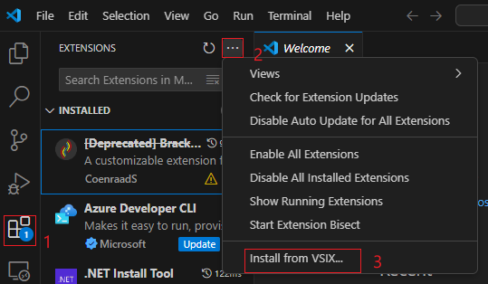

# Show OpenAPI3 Documentation Test Scenario

Provides users with OpenAPI3 preview functionality for Typespec files. Users can view API specifications through the Show OpenAPI3 Documentation feature.

**Important: There must be at least one TypeSpec project in the project folder.**

## Test Environment

- OS : Windows or Linux

> Note: The extension should support all test cases in VS Code for Windows and Linux.

## Prerequisites

Install TypeSpec Compiler before starting to write TypeSpec.

- [Node.js 20+](https://nodejs.org/download/)
- Npm 7+
- [Install TypeSpec Compiler CLI](https://typespec.io/docs/): `"npm install -g @typespec/compiler"`
- Install `@typespec/openapi3`: `"npm install @typespec/openapi3"`

## Test Steps

### Step 1: Install the typespec extension.

_Option 1_. Install using .vsix file:
Click `Extension` -> `…` -> `Install form VSIX...`. Choose the `.vsix` file you want to install locally.

_Option 2_. Install typespec with vscode extension marketplace:
`Extension` -> input `TypeSpec` -> `Install`

### Step 2: Trigger "Show OpenAPI3 Documentation".

_Option 1_. From the right-click context menu of a `.tsp` file.

_Option 2_. Typing `>TypeSpec: Show OpenAPI3 Documentation` in the _Command Palette_.

### Step 3: Select OpenAPI3 files. (optional)

- If multiple OpenAPI3 files are generated, you will be prompted to select one to preview.
  **Validate:** There should be a prompt "Multiple OpenAPI3 files found. Select one to preview", and generated OpenAPI3 files.
  

- If only one OpenAPI3 file is generated, the selection will be skipped.

### Step 4: Compilation completed successfully.

After selecting the OpenAPI3 file, the file will be loaded. After the loading is successful, you can display the OpenAPI3 preview in vscode.

## Issue Report

When an error is detected, it's necessary to document the findings by using the following form:

| No  |                  Title                  |         Issue Description          |                                                                            Repro Steps                                                                            |           Expected Results           |           Actual Results           |  Comments  |
| --- | :-------------------------------------: | :--------------------------------: | :---------------------------------------------------------------------------------------------------------------------------------------------------------------: | :----------------------------------: | :--------------------------------: | :--------: |
| 1   | e.g. Show OpenAPI3 Documentation failed | Failed to generate OpenAPI3 files. | 1. Right-click context menu of a .tsp file.   2. Select Show OpenAPI3 Documentation.   3. Select OpenAPI3 files.   4. Failed to generate OpenAPI3 files. | Generate OpenAPI3 file successfully. | Failed to generate OpenAPI3 files. | Issue link |

## Test Results Summary

The test results will be presented in the following form:

| NO  |         Test Cases          |   Platform    | Result | Issues | Comments |
| --- | :-------------------------: | :-----------: | :----: | :----: | :------: |
| 1   | Show OpenAPI3 Documentation | Windows/Linux |        |        |          |
