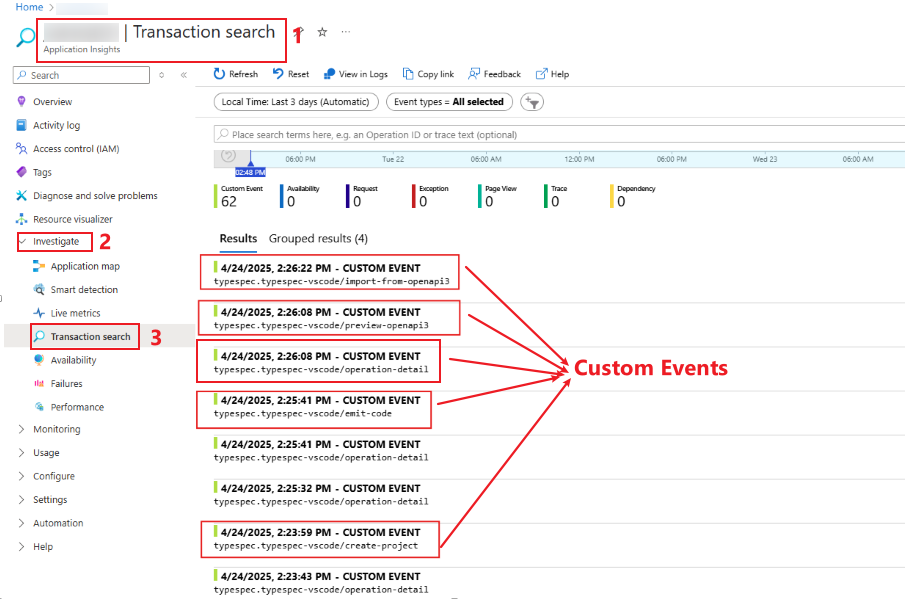
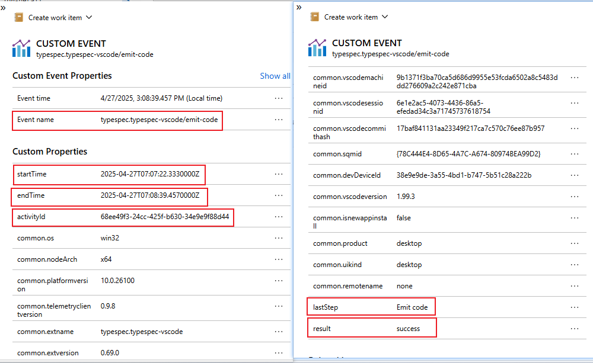
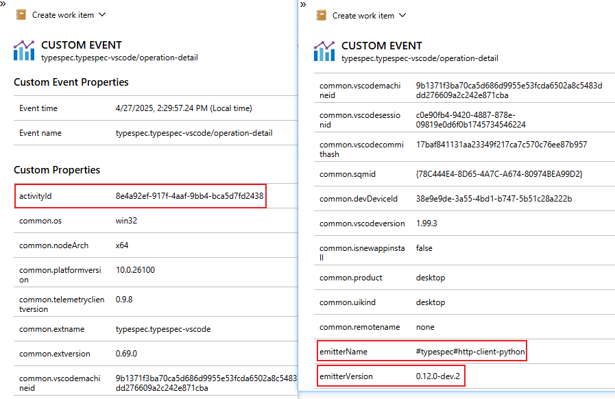
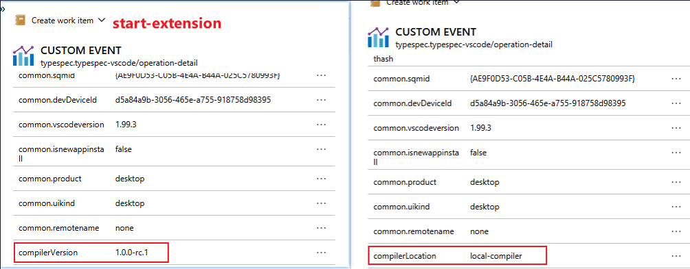
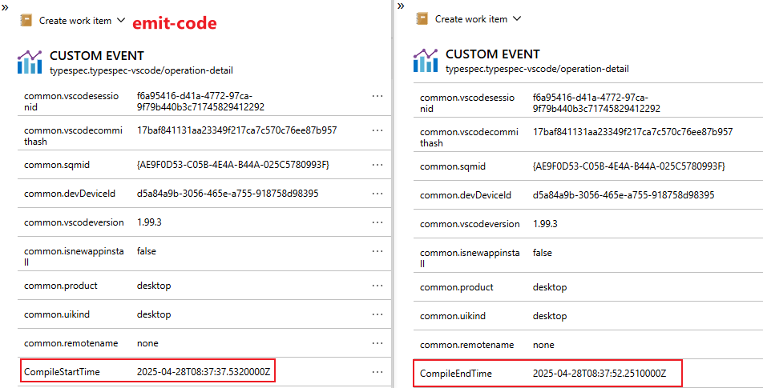
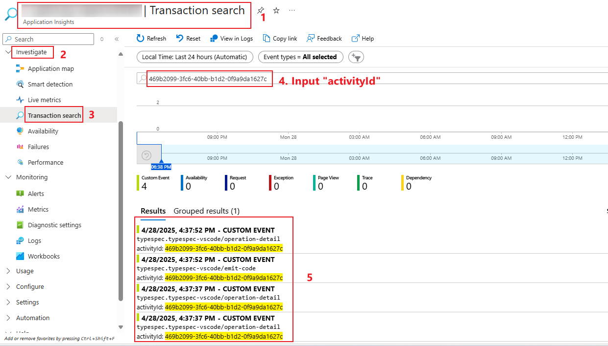
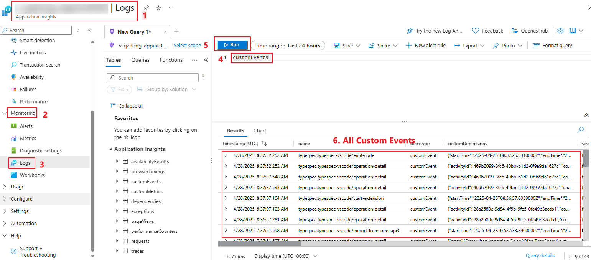
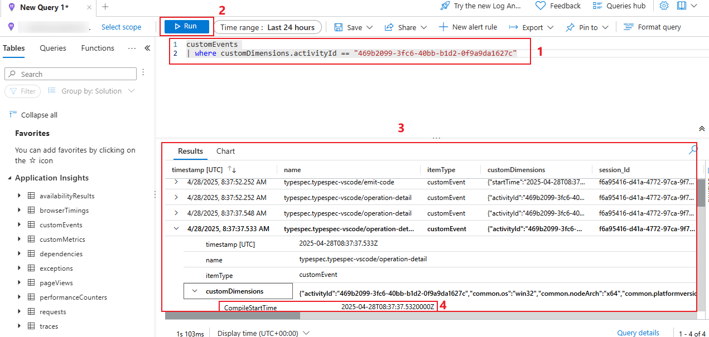

# Telemetry Test Scenario

The extension for Visual Studio Code collects usage data and sends it to Microsoft to help improve our products and services. When telemetry is enabled, it will detect telemetry data from the following test scenarios：

- Create TypeSpec Project 
- Emit from TypeSpec
- Import TypeSpec from OpenAPI 3
- Preview API Documentation

## Test Environment

- OS: Windows or Linux
- Typespec Operations: `create-project`, `emit-code`, `import-from-openapi3`, `preview-openapi3`, `start-extension`, etc
- Telemetry Data: 
  - OperationTelemetry: `EventName, ActivityId, StartTime, EndTime, Result, LastStep`
  - OperationDetailTelemetry: `ActivityId, EmitterName, EmitterVersion, CompilerVersion, CompilerLocation, CompileStartTime, CompileEndTime, Error`

## Prerequisites

Install TypeSpec Compiler before starting to write TypeSpec.

- [Node.js 20+](https://nodejs.org/download/)
- Npm 7+
- [Install TypeSpec Compiler CLI](https://typespec.io/docs/): `"npm install -g @typespec/compiler"`
- Prepare or create an application insights in Azure Portal.

## Test Steps

### Step 1: Get the key of an application insights, and set the valid telemetry key `TYPESPEC_VSCODE_TELEMETRY_KEY` in the local environment to enable telemetry.
- In Windows:
  ```powershell
  setx TYPESPEC_VSCODE_TELEMETRY_KEY "value"
  ```

- In Linux:
  ```bash
  sudo nano /etc/environment
  TYPESPEC_VSCODE_TELEMETRY_KEY="value"
  source /etc/environment
  ```

### Step 2: Execute some typespec operations: `Create a TypeSpec Project`, `Emit from TypeSpec`, `ImportTypeSpec from OpenAPI 3`, `Preview API Documentation`, etc.

> Note: For specific test case steps, please refer to the corresponding test case files, such as: `create-typespec-project-test-case.md`.

### Step 3: Log in to the application insights to check telemetry data. 

_Option 1_. View telemetry data through `Transaction search` in application insights.
  1. Click `Application Insights` -> `Investigate` -> `Transaction search`, there will be some custom events, including: `create-project`, `emit-code`, `import-from-openapi3`, `preview-openapi3`, `operation-detail`, `start-extension`, etc.
  

  1. Click all custom events to check if the telemetry data is correct.
  - OperationTelemetry:
  

  > Note: The above is an example of the "emit-code" operation.

  - OperationDetailTelemetry：
  
  
  
  Besides, if you want to find all the related details of a specific operation (such as: `emit-code`), here is a quick method, you can search for the `ActivityId`.
  

_Option 2_. View telemetry data through `Logs` in application insights.
  1. Click `Application Insights` -> `Monitoring` -> `Logs`, input log query `customEvents` and click `Run`, there will be all custom events, including: `create-project`, `emit-code`, `import-from-openapi3`, `preview-openapi3`, `operation-detail`, `start-extension`, etc.
  

  1. Find the `ActivityId` of the operation you want to query, input detailed log query, click `Run`, and will get all the related details about this specific operation (such as: `emit-code`). Click these custom events to check if the telemetry data (`OperationTelemetry` and `OperationDetailTelemetry`) is correct. 
  
> Note: Log query example: `customEvents | where customDimensions.activityId == "value";`

##### Introduction to telemetry data.  For more information, please check the [link](https://typespec.io/docs/introduction/editor/vscode/).

- OperationTelemetry

  | Telemetry Name | Type | Example |  
  | -------- | -------- | -------- |  
  | EventName | string   | "create-project", "emit-code", "import-from-openapi3", "preview-openapi3", "start-extension", etc   |  
  | ActivityId| string  |   |  
  | StartTime   | datetime   |  | 
  | EndTime  | datetime  |   |  
  | Result  | string   | ”success”,“fail”,“cancelled”, etc.   | 
  | LastStep  | string  |    |  
- OperationDetailTelemetry

  | Telemetry name | Type | Example |  
  | -------- | -------- | -------- |  
  | ActivityId   | string  |    |  
  | EmitterName   | string   | "#typespec#http-client-csharp" for example. The extension will log only names of pre-defined emitters. Unknown emitters from customers will be masked to ensure privacy.   |
  | EmitterVersion   | string   |    |  
  | CompilerVersion  | string   |    |  
  | CompilerLocation  | string   | ”global-compiler”, “local-compiler”, etc. It is not to store the actual path of compiler being installed.  |  
  | CompileStartTime   | datetime  |    |
  | CompileEndTime   | datetime   |    |  
  | Error  | string  | tsp compiling errors   |

> Notes: `CompilerVersion` and `CompilerLocation` will be recorded in the operation detail of `start-extension` task; `CompileStartTime` and `CompileEndTime` will be recorded in the operation detail related of `emit-code` task.

## Issue Report

When an error is detected, it's necessary to document the findings by using the following form:

| No  |                  Title                  |         Issue Description          |                                                                            Repro Steps                                                                            |           Expected Results           |           Actual Results           |  Comments  |
| --- | :-------------------------------------: | :--------------------------------: | :---------------------------------------------------------------------------------------------------------------------------------------------------------------: | :----------------------------------: | :--------------------------------: | :--------: |
| 1   | e.g. Collect telemetry data failed | Failed to collect telemetry data for emit code. | 1. Get the key of an application insights, and set the valid telemetry key in the local environment to enable telemetry. <br> 2. Execute some typespec operations. <br> 3. Log in to the application insights to check telemetry data. | Collect telemetry data successfully. | Failed to collect telemetry data for emit code. | Issue link |

## Test Results Summary

The test results will be presented in the following form:

| NO  |         Test Cases          |   Platform    | Result | Issues | Comments |
| --- | :-------------------------: | :-----------: | :----: | :----: | :------: |
| 1   | Telemetry - Emit Code | Windows/Linux |        |        |          |
