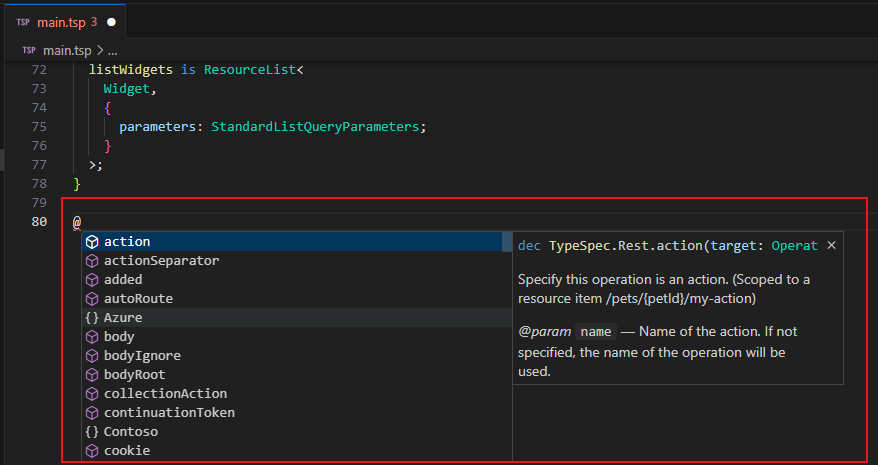
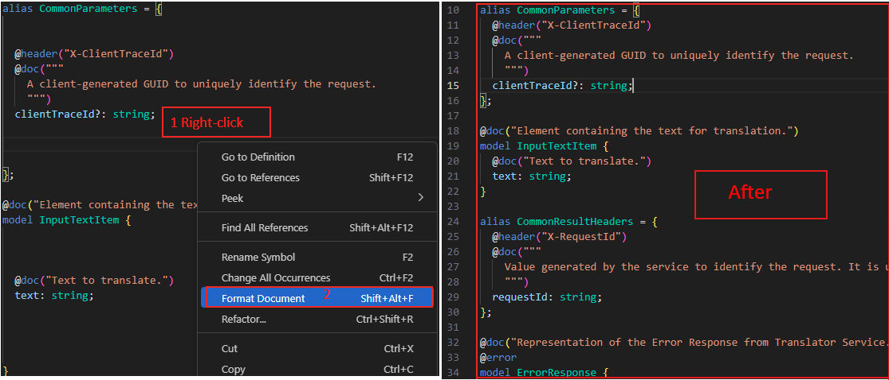
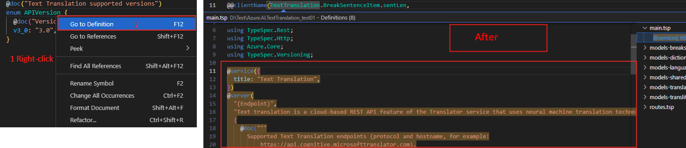

# TypeSpec Extension Basic Features Test Scenario

The TypeSpec for VS Code extension provides TypeSpec language support for VS Code.

## Features

- [Syntax highlighting](#for-syntax-highlighting)
- [Live diagnostic reporting](#for-live-diagnostic-reporting)
- [Code completion](#for-code-completion)
- [Code folding](#for-code-folding)
- [Formatting](#for-formatting)
- [Hover info](#for-hover-info)
- [Rename refactoring](#for-rename-refactoring)
- [Go to definition](#for-go-to-definition)

## Test Environment

- OS : Windows or Linux
- Editor: Visual Studio Code

> Note: The extension should support all test cases in VS Code for Windows and Linux. Mac support is a stretch goal for Selenium semester.

## Test Steps

### Step 1: Open a TypeSpec project and view a .tsp file.

**Validate:** The code color is gray.

### Step 2: Install the TypeSpec for VS Code extension.

_Option 1_. Install using .vsix file:
`Extension` -> `…` -> `Install form VSIX...`

Find the .vsix file you want to install locally.

_Option 2_. Install typespec with vscode extension marketplace:
`Extension` -> input `TypeSpec for VS Code` -> `Install`

### Step 3: Install TypeSpec Compiler CLI

[Install TypeSpec Compiler CLI](https://typespec.io/docs/) command: `"npm install -g @typespec/compiler"`.

### Step 4:

- #### For Syntax highlighting:

  View the .tsp file again, check the display of keywords, types, comments, and so on in the file.

  **Validate:** Keywords, types, comments, etc. should be highlighted in different colors.

  

- #### For Live diagnostic reporting:

  1. Introducing errors in the file, such as declaring an undefined type.

     

  2. View error message.

     **Validate:** A real-time diagnostic error message should be displayed.

     

- #### For Code completion:

  Start typing keywords in the file.

  **Validate:** Whether to automatically pop up a completion prompt to list possible types, attributes, and operations.

  - For `.tsp` file, press `ctrl + space`.
    

  - For `tspconfig.yaml` file, press `ctrl + space`.
    

- #### For Code folding:

  Open a .tsp file containing multiple code blocks and try to fold and expand the code blocks.

  **Validate:** Code blocks should collapse and expand normally.

  

- #### For Formatting:

  1. Modify the encode format.

     

  2. Using the formatting command.

     

     **Validate:** Once formatted, the document should conform to the expected style standards.

     

- #### For Hover info:

  In the .tsp file, hover the mouse over the type or property to check if the hover information box pops up.

  **Validate:** Detailed information about the type or property should be displayed.

  

- #### For Rename refactoring:

  Select a tag name in the file and use the Rename command to rename it.

  

  **Validate:** All references to the variable should be automatically updated to ensure consistent code.

  

- #### For Go to definition:

  Select a type or function name in a .tsp file and use the Go to Definition command.

  

  **Validate:** Should jump to the definition of the selected type or function.

  

## Issue Report

When an error is detected, it's necessary to document the findings by using the following form:

| No  |            Title             |             Issue Description              |                                                                                                Repro Steps                                                                                                 |                     Expected Results                     |      Actual Results      |  Comments  |
| --- | :--------------------------: | :----------------------------------------: | :--------------------------------------------------------------------------------------------------------------------------------------------------------------------------------------------------------: | :------------------------------------------------------: | :----------------------: | :--------: |
| 1   | e.g. Go to definition failed | Using Go to definition fails in .tsp file. | 1. Open a .tsp file.   2. Install the TypeSpec for VS Code extension.   3. Install TypeSpec Compiler CLI.   4.Select a type or function name in a .tsp file and use the Go to Definition command. | Jump to the definition of the selected type or function. | Go to definition failed. | Issue link |

## Test Results Summary

The test results will be presented in the following form:

| NO  |                   Test Cases                    |   Platform    |         Features          | Result | Issues | Comments |
| --- | :---------------------------------------------: | :-----------: | :-----------------------: | :----: | :----: | :------: |
| 1   | TypeSpec Extension Basic Features Test Scenario | Windows/Linux |    Syntax highlighting    |        |        |          |
| 2   | TypeSpec Extension Basic Features Test Scenario | Windows/Linux | Live diagnostic reporting |        |        |          |
| 3   | TypeSpec Extension Basic Features Test Scenario | Windows/Linux |      Code completion      |        |        |          |
| 4   | TypeSpec Extension Basic Features Test Scenario | Windows/Linux |       Code folding        |        |        |          |
| 5   | TypeSpec Extension Basic Features Test Scenario | Windows/Linux |        Formatting         |        |        |          |
| 6   | TypeSpec Extension Basic Features Test Scenario | Windows/Linux |        Hover info         |        |        |          |
| 7   | TypeSpec Extension Basic Features Test Scenario | Windows/Linux |    Rename refactoring     |        |        |          |
| 8   | TypeSpec Extension Basic Features Test Scenario | Windows/Linux |     Go to definition      |        |        |          |
