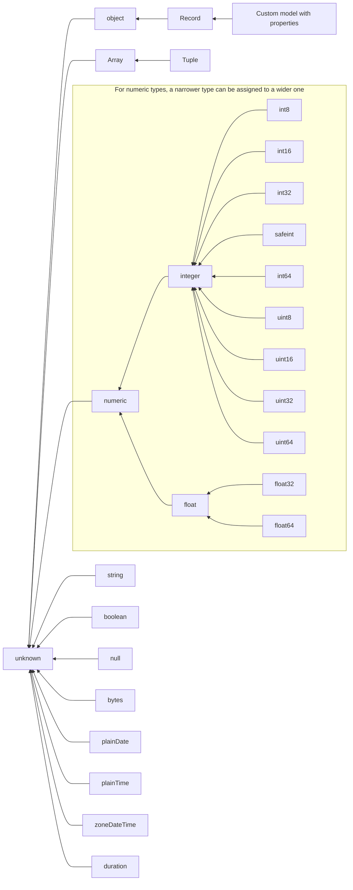

# Types Relations

## Type hierachy



## Model with properties

When checking if type `S` can be assigned to type `T`, if `T` is a model with properties, it will look for all those properties to be present inside of `S` and their type be assignable to the type of the property is T.

For example

```cadl
model T {
  foo: string;
  bar: int32;
}

// Valid

model S { // When properties types are the exact same
  foo: string;
  bar: int32;
}
model S { // When the properties types are literal assignable to the target type
  foo: "abc";
  bar: 123;
}
model S {
  foo: string;
  bar: int8; // int8 is assignable to int16
}
model S {
  foo: string;
  bar: int32;
  otherProp: boolean; // Additional properties are valid.
}

// Invalid
model S { // Missing property bar
  foo: string;
}
model S {
  foo: string;
  bar: int64; // int64 is NOT assignable to int32
}
```

## Record<T>

A record is a model indexed with a string with value of T. This means that it represents a model where all properties(string key) are assignable to the type T. You can assign a model expression where all the properties are of type T or another model that `is` also a `Record<T>`

```cadl
// Represent an object where all the values are int32.
alias T = Record<int32>;

// Valid
alias S = {
  foo: 123;
  bar: 345;
};
alias S = {
  foo: int8;
  bar: int32;
};
model S is Record<int32>;
model S is Record<int32> {
  foo: 123;
}

// Invalid
alias S = {
  foo: "abc";
  bar: 456;
};
alias S = {
  foo: int64;
  bar: int32;
};
model S {
  foo: 123;
  bar: 456;
}
```

#### Why is the last case not assignable to `Record<int32>`?

In this scenario

```cadl
alias T = Record<int32>;
model S {
  foo: 123;
  bar: 456;
}
```

The reason is `model S` here is not assignable but the model expression `{ foo: 123; bar: 456; }` is, is that model S could be extended with additional properties that could then not be compatible.

If you for example now add a new model

```cadl
model Foo is S {
  otherProp: string;
}
```

Now here `Foo` is assignable to `S` following the [model with property logic](#model-with-properties) and if `S` was assignable to `Record<int32>`, `Foo` would be able to be passed through as well but this is now invalid as `otherProp` is not an `int32` property.
