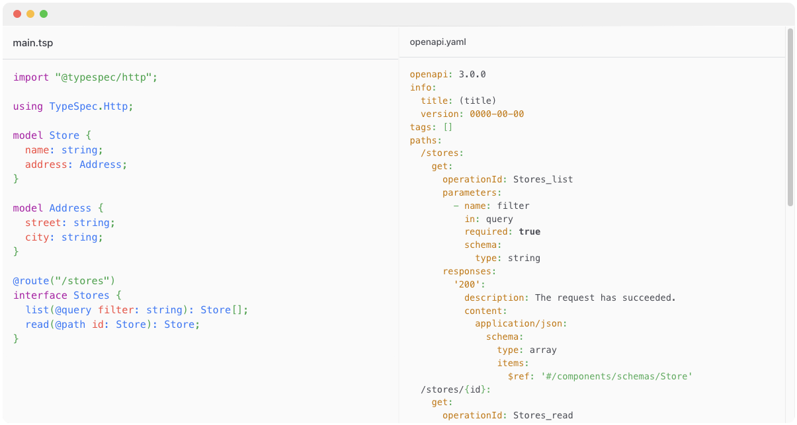

Over last few years, we've been hard at work on https://typespec.io/, a modern API definition language. This language is designed to meet the evolving needs of API developers, architects, and managers in an environment where the delivery of consistently high-quality APIs and related experiences is becoming increasingly complex and critical.

TypeSpec is more than just a new language; it's a platform that enables abstraction, encourages code reuse, and leverages modern tooling for rapid development. Meeting these needs requires a blend of innovative technology and fresh processes that place the API as the fundamental truth on which we build our sophisticated abstractions.

<!-- truncate -->

TypeSpec describes APIs using any protocol or serialization format with concise, familiar syntax and great editor tooling for Visual Studio and VS Code. It can encapsulate common data types, API patterns, and API guidelines into high level, reusable components that can be shared across teams or ecosystems. It can compile to standards compliant OpenAPI, JSON Schema, or Protobuf (or even all three at the same time).

We believe this new technology unlocks new ways for developers to build APIs and the applications around them in a more productive and higher quality way than in the past.

## Key Features

### Interoperability

TypeSpec is not just another API description language; it's a higher-level definition language capable of defining your API and then outputting many different protocols, clients, servers, documentation and more, even simultaneously. This makes it a versatile tool that can adapt to a variety of development scenarios.
Furthermore, TypeSpec is committed to being interoperable with industry standard API definition languages, bridging the gap between different choices.

### Productivity

TypeSpec provides a superior developer experience, making the process of defining data and APIs both enjoyable and productive. The language is concise and able to define complex data and API shapes with minimal typing.
Its tooling makes development and maintenance a breeze, surfacing errors and guideline violations at development time, long before any human review process gets involved.

### API Patterns

TypeSpec improves API quality by encapsulating common data types, API patterns, and API guidelines into high-level, reusable components that can be shared across teams or ecosystems.
This alignment of components with domain and business-specific concepts ensures that specs are written in a language everyone understands, rather than low-level protocol details.

### Familiarity

Inspired by TypeScript and C#, TypeSpec is easy to learn and feels familiar to many developers, reducing the learning curve.

### Extensibility

TypeSpec can be extended with custom decorator vocabularies and type templates, allowing you to model APIs in your business or application logic domain.
Its extensibility allows it to describe many different protocols, serialization formats, or domain-specific metadata, serving as a source-of-truth for anything API-related.

### Ecosystem

TypeSpec allows packaging of common types, language extensions, linters, and emitters into packages, which can be distributed on NPM within your organization or across the ecosystem.

## Community and Collaboration

### Used at Microsoft

At Microsoft, we believe in the value of using our own products, a practice often referred to as "dogfooding". This approach allows us to test and understand our products firsthand.
Many Azure services within Microsoft have already adopted TypeSpec, and the number is growing daily. This internal use of TypeSpec not only demonstrates its effectiveness but also provides us with valuable feedback for continuous improvement. By using TypeSpec in our own development processes, we ensure its reliability and efficiency for API development.
Harnessing the power of TypeSpec, the Microsoft Graph team has revolutionized API development within Microsoft. This collaboration has enhanced productivity and simplified customization, underscoring TypeSpec's potential.

> "In the Microsoft Graph team, we've been excited to partner with our colleagues building TypeSpec to create a productive and innovative environment for the engineers creating all the varied and rich APIs accessible through Microsoft Graph.
> TypeSpec has provided us with an amazing platform to build terse and expressive API descriptions, and customizing the language to match Microsoft Graph's domain has been easy and fun."

### Join Us

TypeSpec is more than just a language; it's a community. We believe in the power of collaboration, and that's why TypeSpec is open source. We invite developers from all backgrounds to join the public beta and experience the power of TypeSpec firsthand. Your feedback is invaluable in shaping the future of TypeSpec, and we encourage you to share your thoughts, suggestions, and bug reports on our community forums.

## Conclusion

TypeSpec is a powerful tool that can revolutionize the way you approach API development. By facilitating an "API First" approach, it allows you to define your APIs upfront, leading to more efficient development and higher quality end products. Its support for a variety of protocols, combined with its extensibility and robust ecosystem, make it a versatile tool that can adapt to a wide range of development scenarios.
We encourage you to try out TypeSpec and experience its benefits firsthand. Whether you're developing an OpenAPI specification, a JSON RPC interface, or simply looking to improve data validation and type consistency, TypeSpec has the capabilities to meet your needs.
Check out our [getting started guide](https://typespec.io/docs), try out TypeSpec in your own projects or in the [TypeSpec Playground](https://typespec.io/playground), and give us feedback on [GitHub](https://github.com/microsoft/typespec)!
We're super excited to work with the community on making TypeSpec awesome as we start our march toward a stable release.
