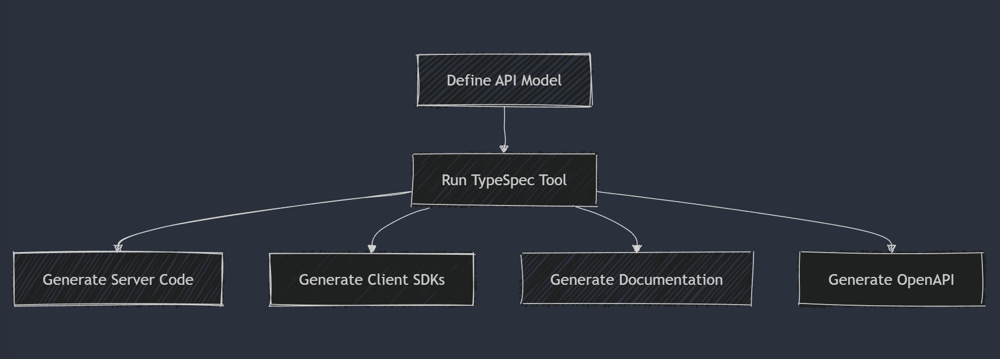

Ever had a great idea for a new service, only to get bogged down by tedious boilerplate code and manual API specifications? With TypeSpec 1.0, you can now turn your API ideas into reality almost as quickly as you think of them.

With the ability to generate client and server code, API schemas, and documentation directly from your concise API spec, TypeSpec accelerates your workflow, bringing your APIs to life at the speed of thought.

TypeSpec was created to address key challenges faced by developers:

- Maintaining consistency across APIs.
- Streamlining API reviews.
- Fostering collaboration.

It aligns with Microsoft's broader vision of empowering developers to innovate faster and more effectively.

Think of it like building a house. You could ask a builder to build a house for you without any specific instructions, but the result might not be what you had in mind. However, if you provide the builder with a detailed blueprint, they can create a house that matches your vision.

In this analogy, TypeSpec is the blueprint for your API in an API-First development process, and the server scaffolding code is the foundation. With this blueprint and foundation in place, you can rapidly and efficiently build the rest of your service.

## What is TypeSpec?

TypeSpec is a concise language for designing APIs, born from our goal to streamline development and address common challenges in API design. With TypeSpec 1.0, you define data models and operations—like tasks in a "to do" service—and our tools generate the server-side and client-side code. It’s for developers who need flexibility and efficiency, no matter your experience level.

Taking design cues from TypeScript and C#, TypeSpec focuses on simplicity and human readability, making it easier for teams to collaborate and maintain consistency. By using TypeSpec, developers can avoid the pitfalls of manual API design and ensure their implementations align perfectly with their specifications.

## The Power of Code Generation

TypeSpec 1.0’s standout feature is its ability to generate both server-side and client-side code directly from TypeSpec source files.



This means you can define your API models and operations in a single source of truth, and TypeSpec will handle the rest. This approach eliminates the need for repetitive coding tasks, reduces the risk of errors, and ensures that your API implementation is always in sync with your specifications.

### Server-Side Code:

- Supports C# and JavaScript for robust backends.
- Eliminates repetitive CRUD coding.
- Keeps specs and code aligned.
- Accelerates workflows.

### Client-side Code Generation

In addition to server-side code, TypeSpec can generate client-side SDKs for multiple languages, including TypeScript, Python, C#, and Java, with support for additional languages like Rust in development. These SDKs simplify integration for developers by abstracting API calls and ensuring consistency with the API specification.

> **TypeSpec-generated SDKs ensure seamless integration with your backend, since everything is derived from the same single source of truth.**

For example, a generated TypeScript SDK might allow you to interact with your `todo` API like this:

```typescript
const client = new TodoServiceClient();
const todo = await client.createTodoItem({
  content: "Buy groceries",
  dueDate: "2025-03-21",
  isCompleted: false,
});
console.log(todo);
```

### Key benefits:

- **Accelerated development**: Jumpstart your server and client implementations with automatically generated models, controllers, and SDKs.
- **API consistency**: Ensure your server and client implementations adhere precisely to your API specification.
- **Reduced manual effort**: Eliminate repetitive coding tasks, freeing you to focus on business logic.
- **Improved maintainability**: Easily update your server and client code as your API evolves by regenerating the stubs and SDKs from the updated TypeSpec definition.

## User Journey: Building a "To Do" Service with TypeSpec

Imagine building a "to do" service API. With TypeSpec, you start by defining your data models and operations in a concise and human-readable format. For example:

```typescript
@route("/todoitems")
namespace TodoItems {
  @get
  op getTodoItems(): GetTodoItemsResponse;

  model GetTodoItemsResponse {
    @statusCode statusCode: 200;
    @body todoitems: TodoItem[];
  }

  @post
  op createTodoItem(@body body: CreateTodoItemRequest): CreateTodoItemResponse;

  model CreateTodoItemResponse {
    @statusCode statusCode: 201;
    @body todoitem: TodoItem;
  }
}

model TodoItem {
  id: string;
  content: string;
  isCompleted: boolean;
  labels: string[];
}

model CreateTodoItemRequest {
  content: string;
  labels?: string[];
}
```

From this definition, TypeSpec generates the foundational server-side code, including controllers and models. Here’s an example of a generated controller method:

```csharp
[HttpGet]
[Route("/todoitems")]
[ProducesResponseType((int)HttpStatusCode.OK, Type = typeof(TodoItem[]))]
public virtual async Task<IActionResult> GetTodoItems()
{
    var result = await TodoItemsOperationsImpl.GetTodoItemsAsync();
    return Ok(result);
}
```

And a corresponding model:

```csharp
public partial class TodoItem
{
    public string Id { get; set; }
    public string Content { get; set; }
    public bool IsCompleted { get; set; }
    public string[] Labels { get; set; }
}
```

With the generated code in place, you can quickly integrate it into your project, build the service, and run it. Testing the API is just as straightforward. For instance, you can use a tool like Thunder Client to send a POST request:

```json
{
  "content": "Buy groceries",
  "labels": ["shopping", "urgent"]
}
```

TypeSpec ensures that your API implementation stays perfectly aligned with your specification, saving you time and effort.

## Getting started with TypeSpec 1.0

Ready to simplify your API development workflow? Follow our [install guide](https://typespec.io/docs/), define your models and operations, and generate code with our tools. Visit [our docs page](https://typespec.io/docs/) for guides and examples, or join our [community](https://typespec.io/community/) to connect. Start prototyping your service API today!

## Build your next big idea with TypeSpec

We’re excited to see how TypeSpec 1.0 transforms your API development workflow! Try it now and experience the power of server and client code generation from a single source of truth. Share your TypeSpec-powered projects with the community or explore advanced examples to inspire new ideas. Your feedback and creativity drive our roadmap.

## Next Steps

TypeSpec 1.0 redefines API development to be less grunt work and more innovation. It’s about empowering you to build faster and smarter. Dive in, explore, and let’s shape the future of APIs together!
