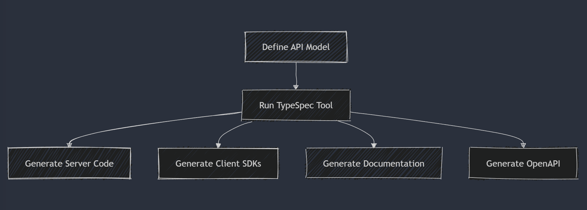

Today, we're thrilled to announce the general availability of TypeSpec 1.0! This milestone marks the transition of TypeSpec's core components from `release candidate` to `stable release` status. TypeSpec is a Microsoft-built, community-supported project that makes API-first development truly practical by empowering you to define your APIs in a concise, human-readable format and generate all the artifacts you need—from OpenAPI specifications to client libraries and server code scaffolding—from a single source of truth.

The Azure SDK team has considered API-first development a best practice for a long time, but implementing it effectively has remained challenging. With TypeSpec 1.0, we're delivering a stable solution that bridges the gap between API design principles and real-world implementation, making API-first development practical for teams of all sizes.

## What's new in the 1.0 release?

Since our [1.0 Release Candidate announcement](/blog/typespec-1-0-RC-release/) in March, we've been working closely with the community to refine TypeSpec based on your feedback. The 1.0 release includes:

- Bug fixes and stability improvements in the core components
- Enhanced documentation and examples
- Performance optimizations
- Refined developer experience in the VS Code extension

## What's included in TypeSpec 1.0?

TypeSpec 1.0 GA includes a foundation of fully supported, production-ready components alongside preview features that are still actively being developed.

### 1.0 components

These components are now officially production-ready:

- **Compiler and core libraries**
  - [@typespec/compiler](https://www.npmjs.com/package/@typespec/compiler): The TypeSpec language compiler
  - [@typespec/http](https://www.npmjs.com/package/@typespec/http): HTTP protocol support
  - [@typespec/openapi](https://www.npmjs.com/package/@typespec/openapi): OpenAPI support

- **IDE support**
  - [typespec-vscode](https://marketplace.visualstudio.com/items?itemName=typespec.typespec-vscode): VS Code extension

- **Stable emitters**
  - [@typespec/openapi3](https://www.npmjs.com/package/@typespec/openapi3): OpenAPI 3.0 output
  - [@typespec/json-schema](https://www.npmjs.com/package/@typespec/json-schema): JSON Schema output

### Preview features

We're continuing to develop and refine these components based on your feedback:

- **Protocol emitters**
  - [@typespec/protobuf](https://www.npmjs.com/package/@typespec/protobuf): Protocol Buffer definitions

- **Libraries**
  - [@typespec/events](https://www.npmjs.com/package/@typespec/events)
  - [@typespec/rest](https://www.npmjs.com/package/@typespec/rest)
  - [@typespec/sse](https://www.npmjs.com/package/@typespec/sse)
  - [@typespec/streams](https://www.npmjs.com/package/@typespec/streams)
  - [@typespec/versioning](https://www.npmjs.com/package/@typespec/versioning)
  - [@typespec/xml](https://www.npmjs.com/package/@typespec/xml)

- **Client/server code generation**
  - [@typespec/http-client-csharp](https://www.npmjs.com/package/@typespec/http-client-csharp)
  - [@typespec/http-client-js](https://www.npmjs.com/package/@typespec/http-client-js)
  - [@typespec/http-client-java](https://www.npmjs.com/package/@typespec/http-client-java)
  - [@typespec/http-client-python](https://www.npmjs.com/package/@typespec/http-client-python)
  - [@typespec/http-server-csharp](https://www.npmjs.com/package/@typespec/http-server-csharp)
  - [@typespec/http-server-js](https://www.npmjs.com/package/@typespec/http-server-js)

- **Experimental emitter framework**

## TypeSpec in action

TypeSpec accelerates API development by letting you define your API in a concise format:

```tsp
import "@typespec/http";
using Http;

@route("/todoitems")
interface TodoItems {
  @get getTodoItems(): TodoItem[];
  @post createTodoItem(@body body: CreateTodoItem): CreatedResponse & TodoItem;
}

model TodoItem {
  @visibility(Lifecycle.Read)
  id: string;

  content: string;
  dueDate: utcDateTime;
  isCompleted: boolean;
  labels?: string[];
}

model CreateTodoItem {
  content: string;
  labels?: string[];
}
```

From this definition, TypeSpec generates everything you need to implement and consume your API:



## Looking ahead

While we're celebrating the 1.0 GA release, we're also excited about the future of TypeSpec. We're actively working on several initiatives to make TypeSpec even more versatile:

### Collaboration with Pinterest on GraphQL

We're thrilled to be collaborating with Pinterest on developing a GraphQL emitter for TypeSpec. This collaboration demonstrates TypeSpec's adaptability to different API paradigms beyond REST.

> "We've been searching for something like TypeSpec for years. What the team has implemented is a thoughtful, practical, and flexible framework that makes writing API specs as good as, if not better than, writing code. This is the future of API design."
>
> — _Pinterest Engineering Team_

### Model-Context Protocol (MCP) Server Emitter

We're exploring the addition of a Model-Context Protocol (MCP) server emitter for TypeSpec. This community-driven initiative will allow developers to describe AI model APIs effectively, showcasing TypeSpec's flexibility in supporting new and emerging protocols.

The MCP work is being developed in the open on [GitHub](https://github.com/bterlson/typespec-mcp), and we encourage you to explore the project and contribute if you're interested.

### Future language features

We're considering new language features to enhance TypeSpec's expressiveness, including:

- Native decorator definitions
- Syntax for declaring state machines
- Additional improvements to make complex API behaviors easier to define

### Emitter improvements

We're working to bring several preview features to full release status, particularly focusing on enhancements to client and server code emitters.

## Community and support

TypeSpec continues to thrive as a community-supported project. Connect with other TypeSpec users and contributors through:

- **[GitHub Issues](https://github.com/microsoft/typespec/issues)**: For bug reports and feature requests
- **[GitHub Discussions](https://github.com/microsoft/typespec/discussions)**: For questions and community support
- **[Discord Community](https://aka.ms/typespec/discord/)**: Connect with other TypeSpec users and the core team
- **[Documentation](https://typespec.io/docs/)**: Comprehensive guides and examples

## We need your feedback!

Your feedback is crucial to the continued improvement of TypeSpec, especially for the components still in preview. Please share your experiences, bug reports, and feature requests on our [GitHub repo](https://github.com/microsoft/typespec).

## Getting started

If you're new to TypeSpec, it's easy to get started:

1. **Install TypeSpec**: Follow our [installation guide](https://typespec.io/docs/) to set up TypeSpec in your environment
2. **Create your first TypeSpec definition**: Try our [quickstart guide](https://typespec.io/docs/getting-started/getting-started-rest/01-setup-basic-syntax/)
3. **Generate artifacts**: Use the TypeSpec CLI or IDE extensions to generate code and specifications
4. **Join our community**: Connect with other TypeSpec users in our [Discord community](https://aka.ms/typespec/discord)

## Thank you!

A huge thank you to everyone who has contributed to TypeSpec, whether through code, testing, documentation, or feedback. This milestone wouldn't have been possible without the support and engagement of our growing community.

We're excited to see what you build with TypeSpec 1.0!
