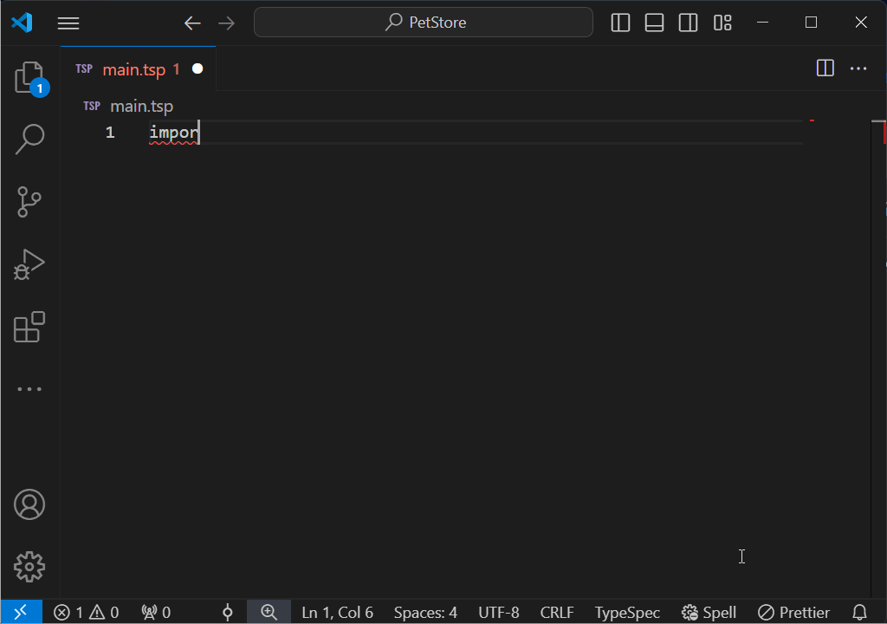
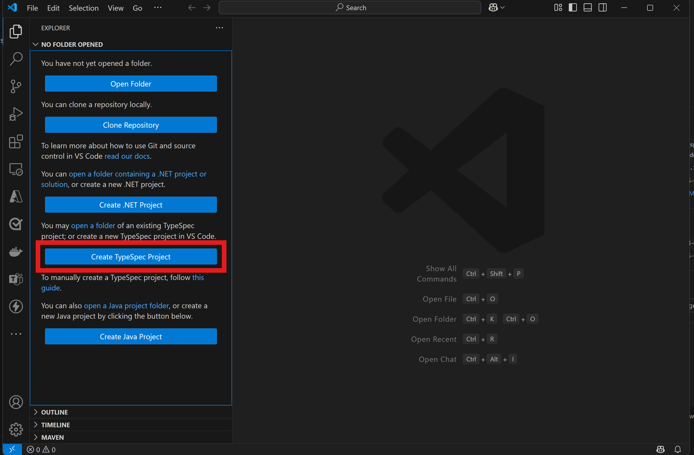
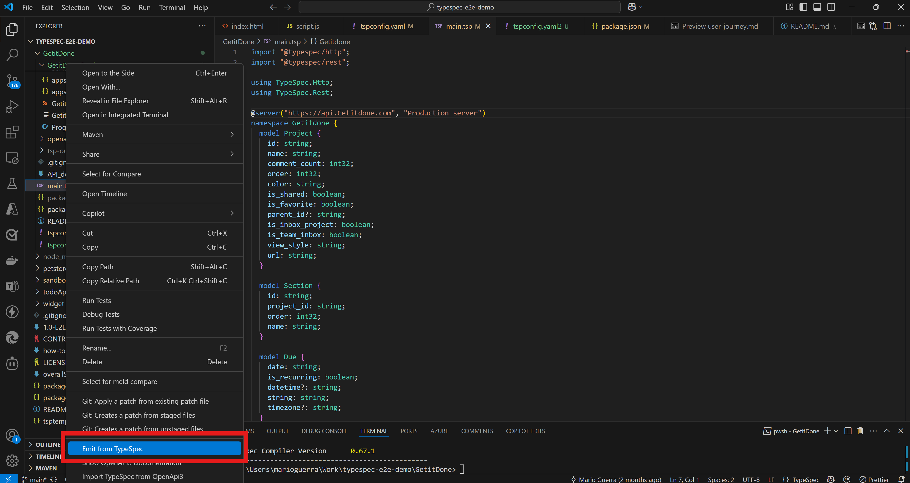

import { FileTree } from "@astrojs/starlight/components";

# Code emission from TypeSpec: user guide

This guide provides a comprehensive overview of emitting both server and client code from your TypeSpec API specifications, empowering you to adopt an API-First development approach. By defining your API contract upfront, you can efficiently scaffold and develop your backend and frontend services, ensuring consistency and alignment across your entire application stack.

## Prerequisites

Before you begin, please ensure you have:

- Node.js and npm installed (for the TypeSpec compiler)
- .NET 9 installed (if you plan to generate C# server code)
- Basic familiarity with TypeSpec
- Please refer to our [installation guide](https://typespec.io/docs/) for the latest setup instructions and requirements.

## Workflow options

You can use the Server Stub Emission feature from TypeSpec in two ways:

1.  **Command-line interface (CLI):** Ideal for automated builds and developers comfortable with the command line.
2.  **Visual studio code (VSCode) IDE with the TypeSpec extension:** Provides a seamless, integrated development experience within VSCode, including features like Intellisense and auto-completion to enhance productivity.



## Configuring `tspconfig.yaml` for client and server code emission

The `tspconfig.yaml` file is the heart of your TypeSpec project. It defines how your TypeSpec code is compiled and what outputs are emitted. To enable both client and server code emission, you need to configure the `emit` and `options` sections of this file.

Here's an example `tspconfig.yaml` file that enables client and server code emission for both C# (ASP.NET Core) and JavaScript (Node.js/Express):

```yaml
emit:
  - "@typespec/openapi3"
  - "@typespec/http-client-csharp"
  - "@typespec/http-client-js"
  - "@typespec/http-server-js"
  - "@typespec/http-server-csharp"
options:
  "@typespec/openapi3":
    emitter-output-dir: "{project-root}/openapi/"
  "@typespec/http-client-csharp":
    emitter-output-dir: "{project-root}/clients/csharp"
  "@typespec/http-client-js":
    emitter-output-dir: "{project-root}/clients/javascript"
  "@typespec/http-server-csharp":
    emitter-output-dir: "{project-root}/servers/aspnet/emitted"
  "@typespec/http-server-js":
    emitter-output-dir: "{project-root}/servers/javascript"
```

**Explanation:**

- **`emit` section:** This section lists the _emitters_ that you want to use. An emitter is a plugin that takes your TypeSpec code and _emits_ output in a specific format (e.g., OpenAPI, C# client, JavaScript server).

  - `"@typespec/openapi3"`: Emits an OpenAPI 3.0 specification. This is primarily used for legacy workflows and is not strictly required for client or server code emission.
  - `"@typespec/http-client-csharp"`: Emits a C# client library.
  - `"@typespec/http-client-js"`: Emits a JavaScript client library.
  - `"@typespec/http-server-csharp"`: Emits a C# (ASP.NET Core) server stub.
  - `"@typespec/http-server-js"`: Emits a JavaScript (Node.js/Express) server stub.

- **`options` section:** This section configures the emitters. For each emitter, you can specify options like the output directory.
  - `emitter-output-dir`: This option specifies where the emitted code should be placed. The `{project-root}` variable refers to the root directory of your TypeSpec project.

**Important:** Make sure you have installed all the necessary emitters:

```bash
npm install -D @typespec/openapi3 @typespec/http-client-csharp @typespec/http-client-js @typespec/http-server-csharp @typespec/http-server-js
```

## Using the CLI to emit client and server code

1.  **Create a TypeSpec project:** If you don't already have one, create a new TypeSpec project using `tsp init`.

    ```bash
    mkdir my-api
    cd my-api
    tsp init
    ```

    During `tsp init`, you will be prompted to select different emitters, including server and client. If you have the necessary dependencies installed, TypeSpec can automatically populate your `tspconfig.yaml` file.

2.  **Define your api:** Write your API specification in a `.tsp` file (e.g., `main.tsp`). This is where you define your models, operations, and routes.

3.  **Compile your TypeSpec:** Use the `tsp compile` command to emit both client and server code, as well as other artifacts based on your specification.

    ```bash
    tsp compile .
    ```

    The compiler will output the emitted client and server code to the directories specified in your `tspconfig.yaml` file (e.g., `clients/csharp` for C# client libraries and `servers/aspnet/emitted` for C# server stubs).

4.  **Project structure:** After compiling, you will typically see the following structure:

{/* prettier-ignore */}
<FileTree>
    my-api/
    ├── tsp-output/
    │   ├── schema/                  # Emitted OpenAPI 3.0 spec
    │   │   └── openapi.yaml
    │   ├── clients/                 # Emitted Client libraries for selected language(s)
    │   │   ├── dotnet/
    │   │   └── node/
    │   └── servers/                 # Emitted Server Code
    │       ├── aspnet/
    │       │   └── emitted/         # Emitted code for ASP.NET
    │       └── node/
    │           └── emitted/         # Emitted code for Node.js
    ├── main.tsp
    ├── tspconfig.yaml
    └── package.json
</FileTree>

## Understanding the emitted code structure

The server stub emission process creates a basic code structure for your server application. The specific files and folders emitted depend on the target language and the complexity of your API.

**C# (ASP.NET core) example:**

Based on a generic 'todo' style app, the emitted code structure for C# will typically include:

{/* prettier-ignore */}
<FileTree>
servers/
┣ aspnet/
┃ ┗ emitted/
┃   ┣ controllers/               # Contains the base controller classes
┃ ┃ ┃ ┣ CommentOpsOperationsControllerBase.cs  # Base class for comment-related API operations
┃ ┃ ┃ ┣ CommentsOperationsControllerBase.cs   # Base class for general comment operations
┃ ┃ ┃ ┣ ... (other controller base classes)
┃   ┣ lib/                     # Utility functions
┃ ┃ ┃ ┣ ArrayConstraintAttribute.cs    # Custom attributes for enforcing array constraints
┃ ┃ ┃ ┣ Base64UrlConverter.cs        # Utility for Base64 URL encoding
┃ ┃ ┃ ┣ ... (other utility files)
┃   ┣ models/                  # Defines the data models (DTOs) used by the API
┃ ┃ ┃ ┣ Attachment.cs              # Data model representing an attachment
┃ ┃ ┃ ┣ Collaborator.cs            # Data model representing a collaborator
┃ ┃ ┃ ┣ ... (other model files)
┃   ┗ operations/              # Defines service interface
┃ ┃ ┃ ┣ ICommentOpsOperations.cs  # Service interface for comment-related operations
┃ ┃ ┃ ┣ ICommentsOperations.cs   # Service interface for general comment operations
┃ ┃ ┃ ┣ ... (other operation interface files)
</FileTree>

- **`lib`**: This directory contains utility classes such as custom attributes used for server side validation to ensure input data adhere to the spec.

- **`Models`**: These files define the data models (also known as Data Transfer Objects or DTOs) used in your API (e.g., `TodoItem.cs`, `Project.cs`). These classes represent the structure of the data being exchanged between the client and the server.

- **`Operations`**: These files define the service interface used for API operations.

**Node.js/express example:**

{/* prettier-ignore */}
<FileTree>
node/
┗ tsp-output/
  ┗ @typespec/
┃   ┗ http-server-javascript/
┃ ┃   ┣ helpers/         # Contains helper functions
┃ ┃ ┃ ┣ header.ts    # Helper for header operations
┃ ┃ ┃ ┣ multipart.ts # Helper for multipart form data
┃ ┃ ┃ ┗ router.ts    # Helper for routing
┃ ┃   ┣ http/           # Contains http request related code
┃ ┃ ┃ ┃ ┗ router.ts    # Helper for setting up http router
┃ ┃   ┗ models/         # Contains emitted data models
┃ ┃ ┃   ┣ all/         # Contains helper import all the data models
┃ ┃ ┃ ┃ ┃ ┗ getitdone/  # Folder containing data models emitted from getitdone namespace
┃ ┃ ┃ ┃ ┃   ┗ index.ts   # Helper to export the data models
┃ ┃ ┃   ┗ synthetic.ts # Type spec synthetic code
</FileTree>

- **`Helpers`**: This folder contains helper functions to perform common operations such as setting header, and multipart operations.

- **`Http`**: This folder contains code for setting up the http requests.

- **`Models`**: This folder contains code and helper functions for all data models.

## Using the VSCode extension

The TypeSpec Extension for VSCode offers a convenient way to emit both client and server code directly from your IDE.

1.  **Install the extension:** Search for "TypeSpec" in the VSCode Extensions Marketplace and install the official TypeSpec extension.

2.  **Create a TypeSpec project:**

    - Click “Create TypeSpec Project” in the EXPLORE sidebar.
    - Select a project root folder.
    - Provide the required inputs via Quick Picks, similar to using `tsp init` on the command line.

    

3.  **Define your api:** Write your API specification in a `.tsp` file.

4.  **Emit the client and server code:**

    - Right-click on a `.tsp` file to open the context menu.
    - Select “Emit from TypeSpec”.
    - Select "Client and Server Code" from the Emitter Types.
    - Choose the desired target language (e.g., ".NET – Emit .Net server stub by @typespec/http-server-csharp").
    - TypeSpec compiler will run in the background, emitting a new directory under "servers\<language>".

    

## Next steps

- **Add business logic:** Implement the core logic for your API endpoints within the emitted server stub. **Remember that the emitted controllers are base classes; you will need to create concrete classes that inherit from them and implement your business logic.**
- **Configure routes:** Verify and configure the routes defined in your server project. You may need to adjust the routing configuration to match your TypeSpec definitions.
- **Add data persistence:** Integrate your server with a database or other data storage solution.
- **Implement authentication and authorization:** Secure your API by adding appropriate authentication and authorization mechanisms.

## Getting help

If you encounter any issues or have questions about TypeSpec and server stub emission, please consult the following resources:

**TypeSpec documentation:**

[Official TypeSpec documentation](https://typespec.io/docs/)

**TypeSpec community:**

[Join our Discord discussion](https://aka.ms/typespec/discord/)

**GitHub issues:**

[Report bugs and suggest features on the TypeSpec GitHub repository](https://github.com/microsoft/typespec/issues)

## Scaffolding your C# server

For C# server code, after emitting the code with TypeSpec, you'll want to scaffold a complete working ASP.NET Core application. The scaffolding process creates all the necessary files to run a functional server implementation.

1. **Scaffold your server code using the `hscs-scaffold` tool:**

```bash
npx hscs-scaffold . --use-swaggerui --overwrite
```

The `--use-swaggerui` flag adds a Swagger UI endpoint to your generated service, which is useful during development as it allows you to interact with your API directly from a browser.

2. **Examine the scaffolded project structure:**

After scaffolding, you'll have a complete ASP.NET Core project structure with:

- Controllers for your API endpoints
- Interface definitions for business logic
- Model classes for data structures
- Mock implementations of your operations

3. **Run your new service:**

```bash
dotnet run --project "tsp-output/server/aspnet"
```

Once running, you can access the Swagger UI by navigating to `https://localhost:<port>/swagger` in your browser, where `<port>` is the port displayed in the console output.

## Understanding the scaffolded C# code structure

The scaffolded C# code is organized into two main categories:

### Generated files (don't modify directly)

Located in the `generated` directory, these files will be regenerated whenever you recompile your TypeSpec definition:

- **Controllers**: Front-end API endpoints that receive HTTP requests

  - These handle the HTTP request/response cycle
  - Each controller method maps to an operation in your TypeSpec interface

- **Operations interfaces**: Definitions for your business logic

  - These interfaces define the methods your implementation will need to fulfill
  - They abstract the business logic from the HTTP concerns

- **Models**: Data structures for requests and responses
  - These directly represent the models defined in your TypeSpec

### Customizable files

These files are intended for you to modify with your implementation:

- **Implementation classes**: Mock implementations of your operations interfaces

  - The emitter generates these with mock implementations that return syntactically correct responses
  - These files **won't be overwritten** when you recompile, preserving your business logic

- **Program.cs**: Application entry point and service configuration

- **MockRegistration.cs**: Dependency injection configuration
  - This file connects your implementation classes to the controller interfaces
  - If you create custom service classes, you'll register them here

## Understanding the dependency injection system

The generated C# service uses ASP.NET Core's dependency injection system to connect controllers with your business logic:

1. Controllers defined in the `generated` folder depend on interface types
2. Your implementation classes implement these interfaces
3. The `MockRegistration.cs` file registers your implementations with the dependency injection container
4. When a request comes in, the controller receives it and calls your implementation

This separation of concerns allows you to focus on implementing business logic without worrying about HTTP protocol details.

## Adding your business logic

Once you've generated and scaffolded your service, you'll need to add your actual business logic:

1. Locate the implementation file for your service (e.g., `Widgets.cs`)

2. Update the implementation methods with your actual business logic. For example:

```csharp
public async Task<Widget[]> ListAsync()
{
    // Replace the mock implementation with your actual database query
    return new Widget[]
    {
        new Widget { Id = "1", Weight = 10, Color = "red" },
        new Widget { Id = "2", Weight = 15, Color = "blue" }
    };
}
```

3. The implementation file won't be overwritten when you recompile your TypeSpec, preserving your business logic.

## Evolving your API

As your API evolves, you'll need to update your TypeSpec definition and regenerate code:

1. Modify your TypeSpec definition (e.g., add new models or operations)

2. Recompile to update the generated code:

```bash
tsp compile .
```

This updates the generated files (controllers, interfaces, models) but preserves your implementation files.

3. If you've added entirely new resources that require new implementation files:

```bash
npx hscs-scaffold .
```

This command is particularly useful when you've added new interfaces in your TypeSpec. For example, if you add a new `Categories` interface:

```typespec
@route("/categories")
@tag("Categories")
interface Categories {
  /** List categories */
  @get list(): CategoryList | Error;
  // More operations...
}
```

When you run the scaffolding step again:

- It will create new files for the new `Categories` interface
- It won't overwrite your existing implementation files with your custom business logic
- This allows you to incrementally add new resources without losing your existing implementations

## Advanced customization options

When scaffolding your C# service, you can use additional options for customization:

```bash
npx hscs-scaffold . --help
```

Some useful options include:

- `--project-name <name>`: Set a custom project name
- `--https-port <port>`: Set a different HTTPS port
- `--output <path>`: Generate files to a different location
- `--use-swaggerui`: Add Swagger UI to explore and test your API
- `--overwrite`: Overwrite existing files (use with caution)
  - Normally, implementation files that already exist won't be overwritten
  - Use this flag if you want to reset your implementations back to the generated mock versions
