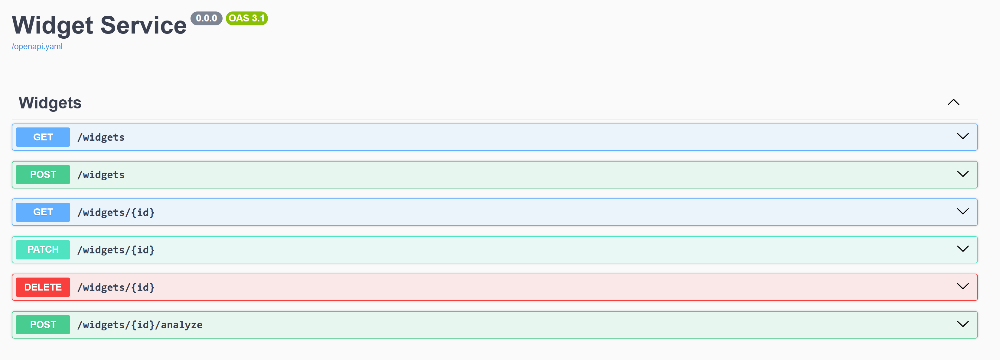

<!-- cspell:ignore myproject -->

# Getting started with TypeSpec server code generation for C#

TypeSpec's code generation capabilities allow you to rapidly build a working API service starting from a TypeSpec definition. This guide walks you through the entire process, from installation to creating and customizing your generated service using the C# server emitter.

## Prerequisites

- .NET 9 installed (required for C# server code generation)
- Node.js and npm (for the installation method)
- Basic familiarity with TypeSpec

## 1. Installing TypeSpec

```bash
npm install -g @typespec/compiler@latest
```

This installs the TypeSpec compiler globally on your system, making the `tsp` command available.

## 2. Creating a TypeSpec project

1. Create and navigate to your project directory:

```bash
mkdir myproject
cd myproject
```

2. Initialize a new TypeSpec project:

```bash
tsp init
```

3. Select the appropriate template when prompted:

   - Choose "Generic REST API" to create a standard REST API
   - Enter a project name or accept the default
   - Select "C# Server Stubs" from the emitter options

4. After initialization completes, your project structure will include:

   - `main.tsp` - Your TypeSpec definition file with a sample service
   - `tspconfig.yaml` - Configuration for your emitters
   - `package.json` - Project dependencies

## 3. Understanding the default TypeSpec service

The `main.tsp` file contains a default "Widget Service" example that defines:

```typespec
import "@typespec/http";

using TypeSpec.Http;
@service(#{ title: "Widget Service" })
namespace DemoService;

model Widget {
  id: string;
  weight: int32;
  color: "red" | "blue";
}

model WidgetList {
  items: Widget[];
}

@error
model Error {
  code: int32;
  message: string;
}

model AnalyzeResult {
  id: string;
  analysis: string;
}

@route("/widgets")
@tag("Widgets")
interface Widgets {
  /** List widgets */
  @get list(): WidgetList | Error;
  /** Read widgets */
  @get read(@path id: string): Widget | Error;
  /** Create a widget */
  @post create(@body body: Widget): Widget | Error;
  /** Update a widget */
  @patch update(@path id: string, @body body: Widget): Widget | Error;
  /** Delete a widget */
  @delete delete(@path id: string): void | Error;

  /** Analyze a widget */
  @route("{id}/analyze") @post analyze(@path id: string): AnalyzeResult | Error;
}
```

This defines:

- A `Widget` model with properties for id, weight, and color
- A REST API with standard CRUD operations (list, read, create, update, delete)
- A special `analyze` operation for widgets

The `tspconfig.yaml` file configures your emitters:

```yaml
emit:
  - "@typespec/openapi3"
  - "@typespec/http-server-csharp"
options:
  "@typespec/openapi3":
    emitter-output-dir: "{output-dir}/schema"
    openapi-versions:
      - 3.1.0
  "@typespec/http-server-csharp":
    emitter-output-dir: "{output-dir}/server/generated"
```

This configuration:

- Generates OpenAPI 3.1.0 schema in the `tsp-output/schema` directory
- Generates C# server code in the `tsp-output/server/generated` directory

## 4. Scaffolding your service

The next step is to generate the server code from your TypeSpec definition. This process is called "scaffolding".

```bash
npx hscs-scaffold . --use-swaggerui --overwrite
```

> **Note about `npx`**: The `npx` command executes binaries from your local node_modules directory. This ensures you're using the version of the scaffold tool installed in your project, which is especially useful if you have multiple TypeSpec projects with different versions.

The `--use-swaggerui` flag adds a Swagger UI endpoint to your generated service. This is useful during development as it allows you to interact with your API directly from a browser.

The console will display information about what it generated and where it placed the files, including:

- The location of your generated project
- How to run the project
- Where to access the Swagger UI

You'll see output similar to this:

```
Your project was successfully created at "tsp-output/server/aspnet"

You can build and start the project using 'dotnet run --project "tsp-output/server/aspnet"'
You can browse the swagger UI to test your service using 'start https://localhost:7348/swagger/'
```

## 5. Running your service

Run the generated service using the following command:

```bash
dotnet run --project "tsp-output/server/aspnet"
```

Once the server is up and running, you can access the Swagger UI by navigating to `https://localhost:<port>/swagger` in your browser, replacing `<port>` with the port listed in the console output, which in the example above is `7348`.

You should see a Swagger UI interface that lists all the available API endpoints, allowing you to test them directly from your browser:



This UI allows you to:

- View all available API endpoints
- Test API operations directly
- See request and response formats

## 6. Understanding the generated code

The scaffolded code is organized into two main categories:

### Generated files (don't modify directly)

Located in the `generated` directory, these files will be regenerated whenever you recompile your TypeSpec definition:

- **Controllers**: Front-end API endpoints that receive HTTP requests

  - Example: `WidgetsController.cs` handles requests to `/widgets`
  - Each controller method maps to an operation in your TypeSpec interface

- **Operations interfaces**: Definitions for your business logic

  - Example: `IWidgets.cs` defines methods like `ListWidgetsAsync()`
  - These interfaces are what your implementation will need to fulfill

- **Models**: Data structures for requests and responses
  - Example: `Widget.cs`, `WidgetList.cs`
  - These directly represent the models defined in your TypeSpec

### Customizable files

These files are intended for you to modify with your implementation:

- **Implementation classes**: Mock implementations of your operations interfaces

  - Example: `Widgets.cs` is where you'll add your business logic
  - The emitter generates these with mock implementations that return syntactically correct responses
  - These files **won't be overwritten** when you recompile, preserving your business logic

- **Program.cs**: Application entry point and service configuration

- **MockRegistration.cs**: Dependency injection configuration
  - This file connects your implementation classes to the controller interfaces
  - If you create custom service classes, you'll register them here

## 7. Understanding the dependency injection system

The generated C# service uses ASP.NET Core's dependency injection system to connect controllers with your business logic:

1. Controllers defined in the `generated` folder depend on interface types (like `IWidgets`)
2. Your implementation classes (like `Widgets`) implement these interfaces
3. The `MockRegistration.cs` file registers your implementations with the dependency injection container
4. When a request comes in, the controller receives it and calls your implementation

If you need to register additional services or dependencies, you would add them to the `MockRegistration.cs` file.

## 8. Adding your business logic

1. Locate the implementation file for your service (e.g., `Widgets.cs`)

2. Update the implementation methods with your actual business logic. For example:

```csharp
public async Task<Widget[]> ListAsync()
{
    // Replace the mock implementation with your actual database query
    return new Widget[]
    {
        new Widget { Id = "1", Weight = 10, Color = "red" },
        new Widget { Id = "2", Weight = 15, Color = "blue" }
    };
}
```

3. The implementation file won't be overwritten when you recompile your TypeSpec, preserving your business logic.

## 9. Evolving your API

As your API evolves, you'll need to update your TypeSpec definition and regenerate code:

1. Modify your TypeSpec definition (e.g., add new models or operations)

2. Recompile to update the generated code:

```bash
tsp compile .
```

This updates the generated files (controllers, interfaces, models) but preserves your implementation files.

3. If you've added entirely new resources that require new implementation files:

```bash
npx hscs-scaffold main.tsp
```

This is particularly useful when you've added new interfaces in your TypeSpec. For example, if you add a new `Categories` interface:

```typespec
@route("/categories")
@tag("Categories")
interface Categories {
  /** List categories */
  @get list(): CategoryList | Error;
  // More operations...
}
```

When you run the scaffolding step again:

- It will create new files for the new `Categories` interface (`CategoriesController.cs`, `ICategories.cs`, and `CategoriesImpl.cs`)
- It won't overwrite your existing `Widgets.cs` with your custom business logic
- This allows you to incrementally add new resources without losing your existing implementations

## 10. Advanced customization options

When scaffolding your service, you can use additional options for customization:

```bash
npx hscs-scaffold main.tsp --help
```

Some useful options include:

- `--project-name <name>`: Set a custom project name
- `--https-port <port>`: Set a different HTTPS port
- `--output <path>`: Generate files to a different location
- `--overwrite`: Overwrite existing files (use with caution)
  - Normally, implementation files that already exist won't be overwritten
  - Use this flag if you want to reset your implementations back to the generated mock versions

## Next steps

- Explore the included README and documentation in the `docs` folder of your generated project
- Add authentication mechanisms to your service
- Implement data validation and error handling
- Connect your implementation to a database

## Additional resources

- [TypeSpec Documentation](https://typespec.io/docs/)
- [TypeSpec Community](https://typespec.io/community/)
- [GitHub Repository](https://github.com/microsoft/typespec)
