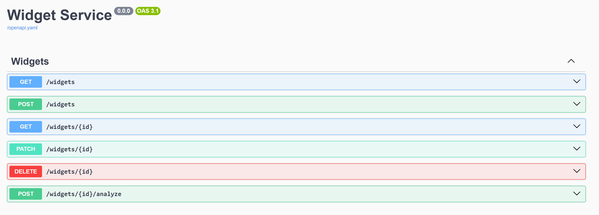

<!-- cspell:ignore myproject -->

# Getting started with TypeSpec server code generation for JavaScript

TypeSpec's code generation capabilities allow you to rapidly build a working API service starting from a TypeSpec definition. This guide walks you through the entire process, from installation to creating and customizing your generated service using the JavaScript server emitter.

## Prerequisites

- Node.js and npm (required for both TypeSpec and JavaScript server code generation)
- Basic familiarity with TypeSpec
- Basic knowledge of JavaScript/TypeScript and Express.js

## 1. Installing TypeSpec

```bash
npm install -g @typespec/compiler@latest
```

This installs the TypeSpec compiler globally on your system, making the `tsp` command available.

## 2. Creating a TypeSpec project

1. Create and navigate to your project directory:

```bash
mkdir myproject
cd myproject
```

2. Initialize a new TypeSpec project:

```bash
tsp init
```

3. Select the appropriate template when prompted:

   - Choose "Generic REST API" to create a standard REST API
   - Enter a project name or accept the default
   - Select "JavaScript Server Stubs" from the emitter options

4. After initialization completes, your project structure will include:

   - `main.tsp` - Your TypeSpec definition file with a sample service
   - `tspconfig.yaml` - Configuration for your emitters
   - `package.json` - Project dependencies

## 3. Understanding the default TypeSpec service

The `main.tsp` file contains a default "Widget Service" example that defines:

```typespec
import "@typespec/http";

using TypeSpec.Http;
@service(#{ title: "Widget Service" })
namespace DemoService;

model Widget {
  id: string;
  weight: int32;
  color: "red" | "blue";
}

model WidgetList {
  items: Widget[];
}

@error
model Error {
  code: int32;
  message: string;
}

model AnalyzeResult {
  id: string;
  analysis: string;
}

@route("/widgets")
@tag("Widgets")
interface Widgets {
  /** List widgets */
  @get list(): WidgetList | Error;
  /** Read widgets */
  @get read(@path id: string): Widget | Error;
  /** Create a widget */
  @post create(@body body: Widget): Widget | Error;
  /** Update a widget */
  @patch update(@path id: string, @body body: Widget): Widget | Error;
  /** Delete a widget */
  @delete delete(@path id: string): void | Error;

  /** Analyze a widget */
  @route("{id}/analyze") @post analyze(@path id: string): AnalyzeResult | Error;
}
```

This defines:

- A `Widget` model with properties for id, weight, and color
- A REST API with standard CRUD operations (list, read, create, update, delete)
- A special `analyze` operation for widgets

The `tspconfig.yaml` file configures your emitters:

```yaml
emit:
  - "@typespec/openapi3"
  - "@typespec/http-server-js"
options:
  "@typespec/openapi3":
    emitter-output-dir: "{output-dir}/schema"
    openapi-versions:
      - 3.1.0
  "@typespec/http-server-js":
    emitter-output-dir: "{output-dir}/server/generated"
```

This configuration:

- Generates OpenAPI 3.1.0 schema in the `tsp-output/schema` directory
- Generates JavaScript server code in the `tsp-output/server/generated` directory

## 4. Scaffolding your service

The next step is to generate the server code from your TypeSpec definition. This process is called "scaffolding".

```bash
npx hsjs-scaffold
```

> **Note about `npx`**: The `npx` command executes binaries from your local node_modules directory. This ensures you're using the version of the scaffold tool installed in your project, which is especially useful if you have multiple TypeSpec projects with different versions.

The console will display information about what it generated and where it placed the files, including:

- The location of your generated project
- How to run the project
- Where to access the Swagger UI

You'll see output similar to this:

```
Your project was successfully created at "tsp-output/server/express"

You can start the project using 'npm start' in the "tsp-output/server/express" directory
You can browse the Swagger UI to test your service at 'http://localhost:3000/api-docs'
```

## 5. Running your service

Navigate to your generated project directory and start the server:

```bash
cd tsp-output/server/express
npm install
npm start
```

Once the server is up and running, you can access the Swagger UI by navigating to `http://localhost:3000/api-docs` in your browser.

You should see a Swagger UI interface that lists all the available API endpoints, allowing you to test them directly from your browser:



This UI allows you to:

- View all available API endpoints
- Test API operations directly
- See request and response formats

## 6. Understanding the generated code

The scaffolded code is organized into two main categories:

### Generated files (don't modify directly)

Located in the `generated` directory, these files will be regenerated whenever you recompile your TypeSpec definition:

- **Routes**: Express route definitions that receive HTTP requests

  - Example: `widgetsRoutes.js` handles requests to `/widgets`
  - Each route maps to an operation in your TypeSpec interface

- **Operations interfaces**: Definitions for your business logic

  - Example: `widgetsInterface.js` defines methods like `listWidgets()`
  - These interfaces are what your implementation will need to fulfill

- **Models**: Data structures for requests and responses
  - Example: `models.js` contains type definitions like `Widget`, `WidgetList`
  - These directly represent the models defined in your TypeSpec

### Customizable files

These files are intended for you to modify with your implementation:

- **Service implementations**: Mock implementations of your operations interfaces

  - Example: `widgetsService.js` is where you'll add your business logic
  - The emitter generates these with mock implementations that return syntactically correct responses
  - These files **won't be overwritten** when you recompile, preserving your business logic

- **app.js**: Express application configuration

  - Sets up middleware, routes, and error handling

- **server.js**: HTTP server configuration and startup

## 7. Understanding the middleware and routing system

The generated JavaScript service uses Express.js middleware and routing:

1. Routes defined in the `generated/routes` folder receive HTTP requests
2. These routes call methods in your service implementation files
3. Your implementation methods return responses that are sent back to the client

The entire system is wired together in the `app.js` file, which:

- Sets up Express middleware (body parsing, CORS, etc.)
- Registers the route handlers
- Configures error handling

## 8. Adding your business logic

1. Locate the service implementation file for your service (e.g., `services/widgetsService.js`)

2. Update the implementation methods with your actual business logic. For example:

```javascript
// Replace the mock implementation with your actual business logic
async function listWidgets() {
  // In a real application, you would fetch data from a database
  return {
    items: [
      { id: "1", weight: 10, color: "red" },
      { id: "2", weight: 15, color: "blue" },
    ],
  };
}
```

3. The implementation file won't be overwritten when you recompile your TypeSpec, preserving your business logic.

## 9. Evolving your API

As your API evolves, you'll need to update your TypeSpec definition and regenerate code:

1. Modify your TypeSpec definition (e.g., add new models or operations)

2. Recompile to update the generated code:

```bash
tsp compile .
```

This updates the generated files (routes, interfaces, models) but preserves your implementation files.

3. If you've added entirely new resources that require new implementation files:

```bash
npx hsj-scaffold main.tsp
```

This is particularly useful when you've added new interfaces in your TypeSpec. For example, if you add a new `Categories` interface:

```typespec
@route("/categories")
@tag("Categories")
interface Categories {
  /** List categories */
  @get list(): CategoryList | Error;
  // More operations...
}
```

When you run the scaffolding step again:

- It will create new files for the new `Categories` interface (`categoriesRoutes.js`, `categoriesInterface.js`, and `categoriesService.js`)
- It won't overwrite your existing `widgetsService.js` with your custom business logic
- This allows you to incrementally add new resources without losing your existing implementations

## 10. Advanced customization options

When scaffolding your service, you can use additional options for customization:

```bash
npx hsjs-scaffold --help
```

Some useful options include:

- `--project-name <name>`: Set a custom project name
- `--port <port>`: Set a different HTTP port (default is 3000)
- `--output <path>`: Generate files to a different location
- `--overwrite`: Overwrite existing files (use with caution)
  - Normally, implementation files that already exist won't be overwritten
  - Use this flag if you want to reset your implementations back to the generated mock versions

## Next steps

- Explore the included README in your generated project
- Add authentication middleware to your service
- Implement data validation and error handling
- Connect your implementation to a database (like MongoDB, PostgreSQL, etc.)
- Deploy your service to a cloud provider

## Additional resources

- [TypeSpec Documentation](https://typespec.io/docs/)
- [TypeSpec Community](https://typespec.io/community/)
- [GitHub Repository](https://github.com/microsoft/typespec)
- [Express.js Documentation](https://expressjs.com/)
