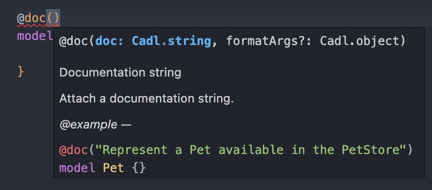

:::caution
This release contains **breaking changes**
:::

## New features

### Decorator signature help

With the decorator signature `extern dec` added in previous release and the doc comment support added in this version the IDE is able to provide a signature help for decorators



## New `scalar` type

:::caution
This is a breaking change [see details here](#change-to-typespec-intrinsic-models)
:::

This release introduce a new [scalar](../language-basics/scalars.md) type meant to represent what were previously models with no properties actually representing an scalar value.

```typespec
scalar uuid extends string;
```

## Emitter options interpolation and standardization

Emitter options are not able to interpolate other values. See [details](../handbook/configuration/configuration.md#variable-interpolation)

```yaml
output-dir: {cwd}/generated
options:
  @typespec/openapi3:
    emitter-output-dir: {output-dir}/openapi3
```

## Breaking changes

### `TypeSpec` `Api` `Compiler` Moved TypeSpec intrinsic types to a new Type `scalar`

A new type has been introduced to TypeSpec in order to differentiate scalar from structured models types. Those new types can be declared using `scalar` and can extend another scalar using `extends`.

#### Change to TypeSpec intrinsic models

All of TypeSpec intrinsic models have been updated to be `scalar` types instead of `model`. In most cases this shouldn't affect a spec but if you are defining a custom model that `is` one of the intrinsic types you'll have to update it

Before

```
model MyStr is string;
```

After

```
scalar MyStr extends string;
```

##### Migration script

The following script can be used to automatically migrate previous usages.

```typespec
npx @typespec/migrate
```

#### Change to Compiler API

Removed:

- `getIntrinsicModelName`: Check it is a std type with `program.checker.isStdType(type)` and then use the `type.name` otherwise look for `type.baseScalar`
- `isIntrinsic`: Check it is a std type with `program.checker.isStdType(type)` or just remove the check if goal was to omit intrinsic types from models.

Migration:

1. Add a new switch to handle the new `scalar` type
2. To resolve a scalar type, check if its a std type using `program.checker.isStdType(type)`
3. If yes, do the same behavior has before with `getIntrinsicModelName`
4. If not, call `scalar.baseScalar` and repeat step 2.

### `API` - Change to `onEmit` signature

The signature of `onEmit` has been updated to accommodate for changes to the emitter options

**Before**

```ts
export function $onEmit(program: Program, options: MyEmitterOptions);
```

**Now**

```ts
export function $onEmit(context: EmitContext);
```

Access properties

| Before                  | Now                                                                                                             |
| ----------------------- | --------------------------------------------------------------------------------------------------------------- |
| `program`               | `context.program`                                                                                               |
| `options`               | `context.options`                                                                                               |
| `options["output-dir"]` | `context.emitterOutputDir` [See details](#typespec-api-emitter-option-output-dir-renamed-to-emitter-output-dir) |

### [TypeSpec] [Api] Emitter option `output-dir` renamed to `emitter-output-dir`

The option has been renamed for all emitters as `emitter-output-dir` is now managed in the compiler
Before

```yaml
emitters:
  my-emitter:
    output-dir: /path/to-output-dir
```

Now

```yaml
emitters:
  my-emitter:
    emitter-output-dir: {output-dir}/for-this-emitter
#                        ^ can now reference the common output-dir
```

### Change to api

**Before**

```ts
export function $onEmit(program: Program, options: MyEmitterOptions) {
  const outputDir = options["output-dir"];
}
```

**Now**

```ts
export function $onEmit(context: EmitContext) {
  const outputDir = context.emitterOutputDir;
}
```

### `API > @typespec/compiler` Multiple services per typespec specs are now allowed making a service accessor obsolete.

The following functions have been deprecated

```ts
export function getServiceTitle(program: Program): string;
export function getServiceVersion(program: Program): string;
export function getServiceNamespace(program: Program): Namespace;
export function getServiceNamespaceString(program: Program): string | undefined;
export function setServiceNamespace(program: Program, namespace: Namespace);
```

and replaced with

```ts
export interface ServiceDetails {
  title?: string;
  version?: string;
}
export interface Service extends ServiceDetails {
  type: Namespace;
}

export function listServices(program: Program): Service[];
export function getService(program: Program, namespace: Namespace): Service | undefined;
export function isService(program: Program, namespace: Namespace): boolean;

export function addService(program: Program, type: Namespace, details?: ServiceDetails);
```

Other changes to the service resolution:

- Title won't be defaulted to `(title)`
- Version won't be defaulted to `0000-00-00`
- Service namespace won't be defaulted to global namespace

| Before                               | To add support for multi serviceF                                                            |
| ------------------------------------ | -------------------------------------------------------------------------------------------- |
| `getServiceNamespace(program)`       | `listServices(program)` to get all services                                                  |
| `getServiceNamespaceString(program)` | `getNamespaceName(service.type)` is where service is `getService(program, serviceNamespace)` |
| `getServiceTitle(program)`           | `service.title` where service is `getService(program, serviceNamespace)`                     |
| `getServiceVersion(program)`         | `service.version` where service is `getService(program, serviceNamespace)`                   |

### `TypeSpec` Directives can no longer be placed in certain contexts.

For example, this is no longer valid:

```typespec
model M<
#suppress example
T
> {}
```

And will now result in an error "Cannot place directive on template parameter".

Move such directives up to the nearest statement, interface operation, model property, operation parameter, union variant, or enum member.

For the above example, that would be:

```
#suppress example
model M<T> {}
```

## Deprecations

:::caution
Deprecated items will be removed in 2 release cycle.
:::

### `TypeSpec > @typespec/rest` - `@segmentSeparator` is deprecated. The `@actionSeparator` decorator should be used instead.

Before

```typespec
@autoRoute
namespace Things {
  @action
  @segmentSeparator(":")
  @put
  op customAction1(
    @segment("things")
    @path
    thingId: string,
  ): string;
}
```

After:

```typespec
@autoRoute
namespace Things {
  @action
  @actionSeparator(":")
  @put
  op customAction1(
    @segment("things")
    @path
    thingId: string,
  ): string;
}
```

### `TypeSpec` Deprecated `uri` being replaced by `url`

Before:

```typespec
model Server {
  endpoint: uri;
}
```

Now:

```typespec
model Server {
  endpoint: url;
}
```

### `Config` - Deprecated `emitters` property in the `tspconfig.yaml`

The `emitters` property of the configuration file has been deprecated and replaced by 2 new properties making it consistent with the CLI

Before:

```yaml
emitters:
  "@typespec/openapi3":
    output-file: openapi3.json
  other-emitter: true
```

After:

```yaml
emit:
  - "@typespec/openapi3"
  - "other-emitter"
options:
  @typespec/openapi3:
    output-file: openapi3.json
```
