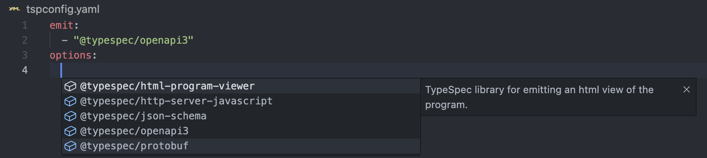

## Notable changes

### Improvements to template instantitation error

If you have used TypeSpec with template you most likely encountered this hard to debug issue where the diagnostic would show up in the template declaration and not help you in understanding who called that template. This could become very tedious when going through many templates.

#### Before

```tsp title=main.tsp
model Spreading<T> {
  ...T;
  // ^ error spread-model Cannot spread properties of non-model type.
}

model Bar {
  prop: Spreading<string>;
}
```

```bash title="Tsp error output"
main.tsp:2:6 - error spread-model: Cannot spread properties of non-model type.
> 2 |   ...T;
    |      ^
```

#### Now

```tsp title=main.tsp
model Spreading<T> {
  ...T;
  // ^ error spread-model Cannot spread properties of non-model type.
  //     main.tsp:6:9 in instantiation of Spreading<string>
}

model Bar {
  // Also show a warning at the point of usage
  prop: Spreading<string>;
  //    ^ warning spread-model In instantiation of this template
  //      main.tsp:2:6 Cannot spread properties of non-model type.
}
```

```bash title="Tsp error output"
main.tsp:2:6 - error spread-model: Cannot spread properties of non-model type.
> 2 |   ...T;
    |      ^
  main.tsp:6:9 - occurred while instantiating template
  > 6 |   prop: Spreading<string>;
      |         ^^^^^^^^^^^^^^^^^
```

### Reference and augment model properties inside of alias and model expressions

A long running issue of TypeSpec was the inability to use augment decorator on variety of cases:

- Properties inside of an alias
- Properties inside of a nested model expression
- Properties comming from a `model is`

You are now able to reference and augment any symbol that can be statically linked(Anything that doesn't involve template instantitation to know its content).

```tsp
// Example 1: augment alias property
alias Alias = {
  prop: string;
};

@@doc(Alias.prop, "My alias doc");

// Example 2: augment nested property
model Author {
  address: {
    city: string;
  };
}

@@doc(Author.address::type.city, "Address city");

// Example 3: Property sourced from model is
model Nameable {
  name: string;
}
model Author is Nameable;

@@doc(Author.name, "Authors name");

// Example 4: Template constraint can be statically linked
model Author<T extends {name: string}> {
  ...T;
}

@@doc(Author.name, "Authors name");

// Example 5: Limitation: Cannot augment properties from a template parameter without constraint
model Base<T> {
  ...T;
}

model Author
  is Base<{
    name: string;
  }>;

@@doc(Base.name, "Authors name");
//    ^ error we cannot know Base will have a property called name
@@doc(Author.name, "Authors name");
//    ^ error we cannot know author has property name without instantiating Base
```

### `tspconfig.yaml` auto complete

TypeSpec Language server now provide completion for the `tspconfig.yaml` file. It will auto complete the structure, available emitters and their options.



### Paginated operations

Addition of a few new decorators allowing declaring paginated operations

```tsp
@list op listPets(): {
  @pageItems pets: Pet[];
  links: {
    @nextLink next?: url;
    @prevLink prev?: url;
    @firstLink first?: url;
    @lastLink last?: url;
  };
};
```

[See pagination docs for more details](../standard-library/pagination.md)

### Xml support in OpenAPI3 emitter

`@typespec/xml` library has been available for a few months but support in openapi3 emitter was lacking.

```tsp title="main.yaml"
@encodedName("application/xml", "XmlPet")
model Pet {
  @Xml.name("ItemsTags")
  tags: string[];
}
```

```yaml title="openapi.yaml"
Pet:
  type: "object"
  properties:
    tags:
      type: "array"
      xml:
        name: "ItemsTags"
        wrapped: true
      items:
        type: string
  xml:
    name: "XmlPet"
```

Example xml:

```xml
<XmlPet>
  <ItemsTags>
    <string>abc</string>
    <string>def</string>
  </ItemsTags>
</XmlPet>
```

[See xml guide for more info](../libraries/xml/guide.md)

## Features

### @typespec/compiler

- [#4807](https://github.com/microsoft/typespec/pull/4807) CLI logs diagnostic source path relative to the CWD.
- [#4871](https://github.com/microsoft/typespec/pull/4871) [experimental] Mutators: Allow mutating namespaces
- [#4470](https://github.com/microsoft/typespec/pull/4470) Add support for paginated operations
- [#4849](https://github.com/microsoft/typespec/pull/4849) Overall of the symbol resolution. TypeSpec is able to resolve anything that can be statically linked. Augment decorators in turn are able to target any statically linkable types.
- [#4806](https://github.com/microsoft/typespec/pull/4806) Diagnostics emitted in template instance include instantiation trace.
- [#4790](https://github.com/microsoft/typespec/pull/4790) Support completion for tspconfig.yaml file in vscode

### @typespec/http

- [#4761](https://github.com/microsoft/typespec/pull/4761) Add `@cookie` decorator to specify cookie parameters
- [#4470](https://github.com/microsoft/typespec/pull/4470) Add new `LinkHeader` pagination type

### @typespec/openapi

- [#4834](https://github.com/microsoft/typespec/pull/4834) Add new `@tagMetadata` decorator to specify OpenAPI tag properties

### @typespec/openapi3

- [#4761](https://github.com/microsoft/typespec/pull/4761) Add `@cookie` decorator to specify cookie parameters
- [#4214](https://github.com/microsoft/typespec/pull/4214) Add XML support using `@typespec/xml` library
- [#4834](https://github.com/microsoft/typespec/pull/4834) Add support for `@tagMetadata` decorator
- [#4906](https://github.com/microsoft/typespec/pull/4906) Updates tsp-openapi3 to support generating `@summary` decorators for models and operations from schema title and path item summary fields.

### typespec-vscode

- [#4790](https://github.com/microsoft/typespec/pull/4790) Support completion for tspconfig.yaml file in vscode
- [#4737](https://github.com/microsoft/typespec/pull/4737) Add basic snippets for typespec
- [#4912](https://github.com/microsoft/typespec/pull/4912) TypeSpec Language Server would be restarted with new settings when setting "typespec.tsp-server.path" is changed

## Bug Fixes

### @typespec/compiler

- [#4745](https://github.com/microsoft/typespec/pull/4745) Improve diagnostic when JS files fail to load due to a JS error

### @typespec/http

- [#4932](https://github.com/microsoft/typespec/pull/4932) [API] Fix: Generated `uriTemplate` correctly include `*` for explode query params
- [#4804](https://github.com/microsoft/typespec/pull/4804) The description parameter of `@server` is now optional.

### @typespec/openapi3

- [#4663](https://github.com/microsoft/typespec/pull/4663) Discriminator properties are marked as required regardless if they are in TypeSpec to match OpenAPI3 spec.
- [#4934](https://github.com/microsoft/typespec/pull/4934) tsp-openapi3 - fixes typespec generation for empty schema
- [#4727](https://github.com/microsoft/typespec/pull/4727) Nullable enum use `allOf` instead of `oneOf`
- [#4708](https://github.com/microsoft/typespec/pull/4708) Updates tsp-openapi3 to include path-level parameters in generated typespec operations.
- [#4873](https://github.com/microsoft/typespec/pull/4873) Updates tsp-openapi3 query decorator generation to use the value arguments.

- [#4672](https://github.com/microsoft/typespec/pull/4672) OpenAPI3 type property should always be set when nullable property is present.

### @typespec/json-schema

- [#4732](https://github.com/microsoft/typespec/pull/4732) Document exported types

### typespec-vscode

- [#4912](https://github.com/microsoft/typespec/pull/4912) Fix the issue when Typespec Language Server can't be restarted when the server wasn't running before
